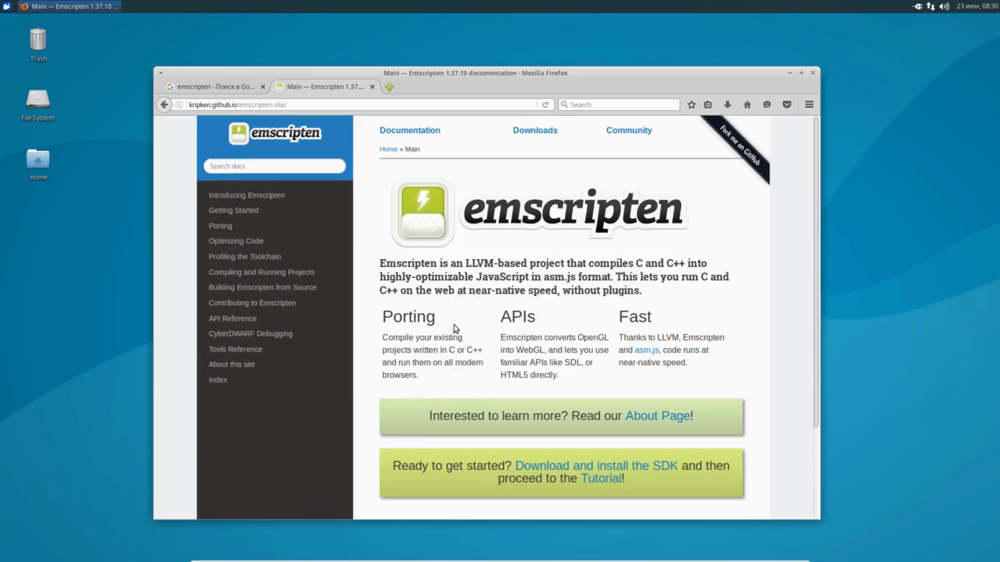
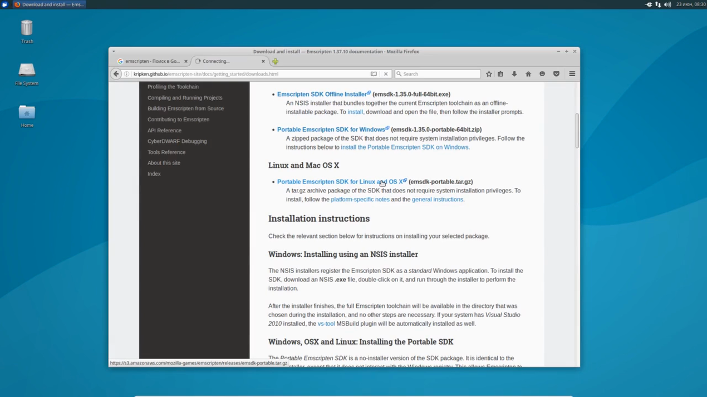
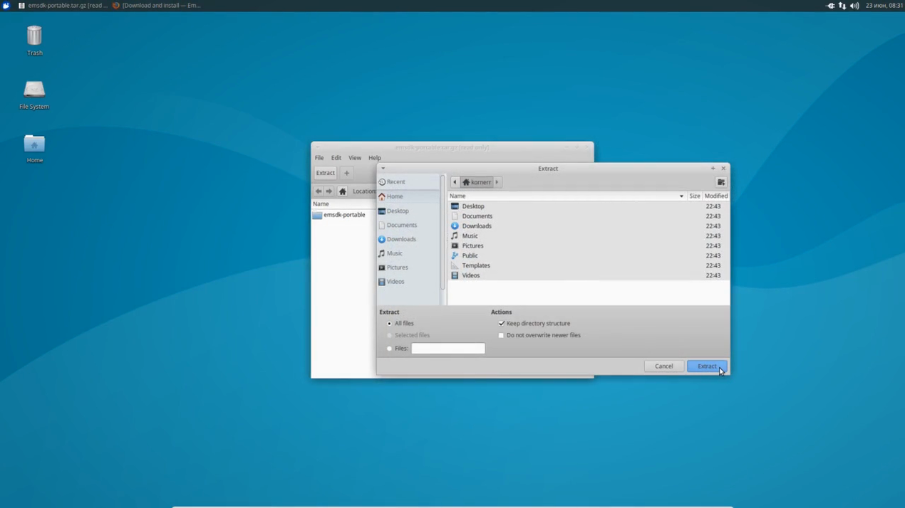
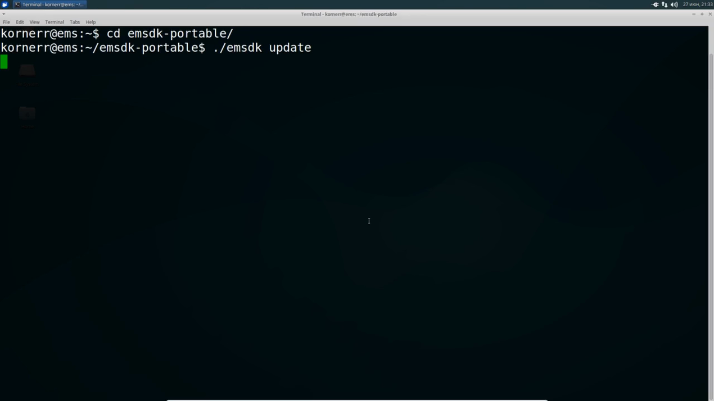
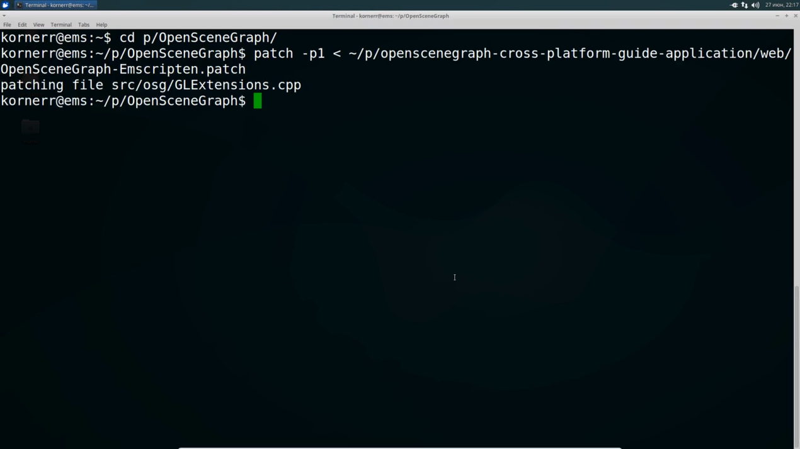
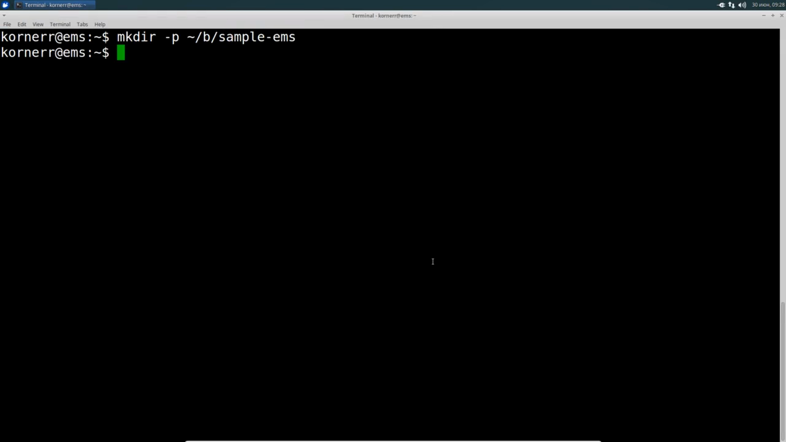
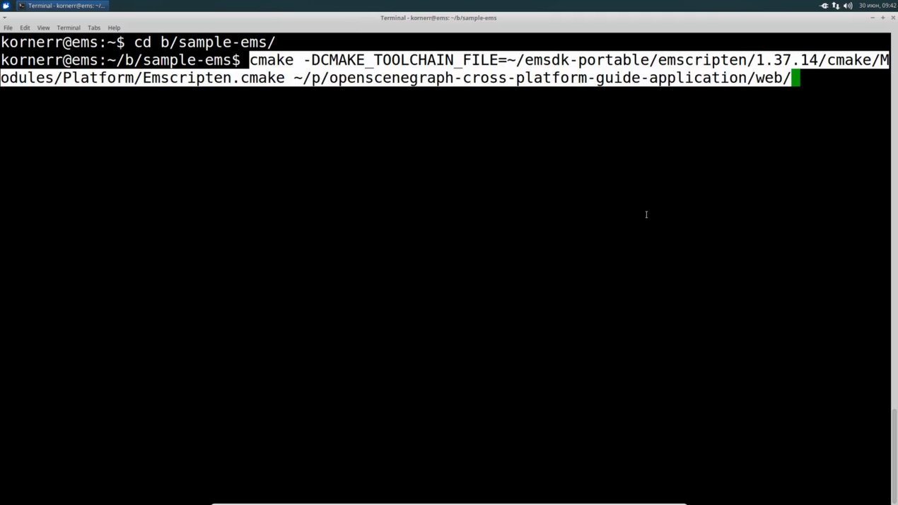
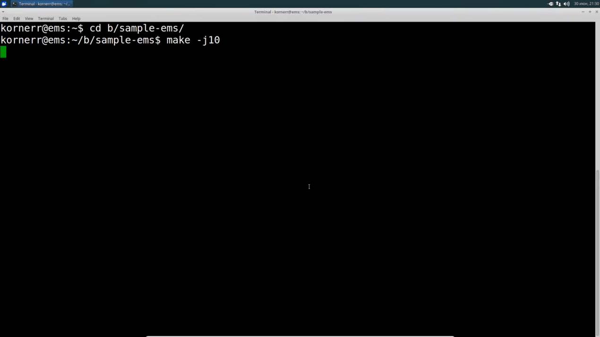
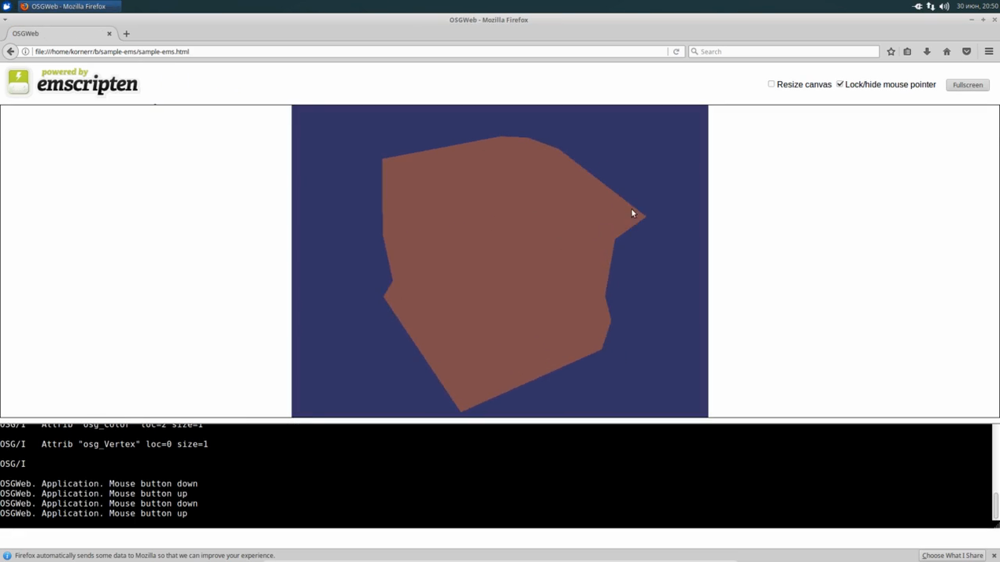
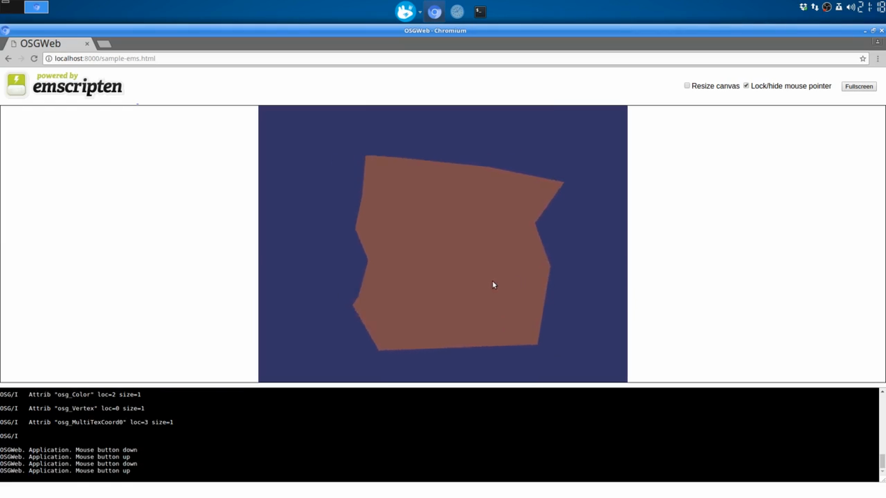

Table of contents
=================

* [Overview](#overview)
* [Video](#video)
* [Steps](#steps)
  * [1.10.1. Find Emscripten site](#step-find-emscripten)
  * [1.10.2. Download Emscripten portable SDK archive](#step-dl-emscripten)
  * [1.10.3. Extract Emscripten portable SDK](#step-extract-emscripten)
  * [1.10.4. Install Emscripten portable SDK](#step-install-emscripten)
  * [1.10.5. Patch OpenSceneGraph](#step-patch)
  * [1.10.6. Create build directory](#step-build-dir)
  * [1.10.7. Configure the build](#step-cfg)
  * [1.10.8. Build application](#step-build)
  * [1.10.9. Run application (Firefox only)](#step-run-ff)
  * [1.10.10. Run application (All browsers)](#step-run)

<a name="overview"/>

Overview
========

This tutorial is part of [OpenSceneGraph cross-platform guide](http://github.com/OGStudio/openscenegraph-cross-platform-guide).

In this tutorial we build and run
[sample OpenSceneGraph application](http://github.com/OGStudio/openscenegraph-cross-platform-guide-application)
under Linux for Web. The application displays provided model with simple GLSL shaders.

**Note**: this tutorial requires
* OpenSceneGraph model (see [1.1. Create a cube](../1.1.CreateCube))
* CMake and git installations (see [1.2. Install OpenSceneGraph under Linux](../1.2.InstallUnderLinux))
* OpenSceneGraph sources (see [1.2. Install OpenSceneGraph under Linux](../1.2.InstallUnderLinux))
* sample OpenSceneGraph application sources (see [1.5. Build and run sample OpenSceneGraph application under Linux](../1.5.SampleUnderLinux)) **alongside OpenSceneGraph sources**

<a name="video"/>

Video
=====

[YouTube](todo) | [Download](readme/video.mp4)

Video depicts running and building sample OpenSceneGraph application
under Xubuntu 16.04 with Emscripten 1.37.9 for Web.

<a name="steps"/>

Steps
=====

**Note**: steps below use frames from the video as screenshots.
Watch the video to see all details.

<a name="step-find-emscripten"/>

1.10.1. Find Emscripten site
----------------------------

  

  Find main Emscripten site.
  
  We need Emscripten portable SDK, because Xubuntu 16.04
  ships an outdated version.

<a name="step-dl-emscripten"/>

1.10.2. Download Emscripten portable SDK archive
------------------------------------------------

  

  Download the latest
  [Emscripten portable SDK archive](http://kripken.github.io/emscripten-site/docs/getting_started/downloads.html).

<a name="step-extract-emscripten"/>

1.10.3. Extract Emscripten portable SDK
---------------------------------------

  

  Unpack Emscripten portable SDK to your home directory.

<a name="step-install-emscripten"/>

1.10.4. Install Emscripten portable SDK
---------------------------------------

  

  Install Emscripten portable SDK by running the following commands:

  `cd /path/to/emsdk-portable`

  `./emsdk update`

  `./emsdk install latest`

  `./emsdk activate latest`

  `source ./emsdk_env.sh`

  **Note**: the above commands come from the
  [official Emscripten installation instructions](http://kripken.github.io/emscripten-site/docs/getting_started/downloads.html).

<a name="step-patch"/>

1.10.5. Patch OpenSceneGraph
----------------------------

  

  **Note**: this step is only necessary if my
  [osgemscripten pull request](https://github.com/openscenegraph/OpenSceneGraph/pull/267)
  is still not accepted into upstream OpenSceneGraph.

  As of now, OpenSceneGraph cannot run under Emscripten unchanged.

  Patch OpenSceneGraph by running the following commands:

  `cd /path/to/OpenSceneGraph`

  `patch -p1 < /path/to/openscenegraph-cross-platform-guide-application/web/OpenSceneGraph-Emscripten.patch`

<a name="step-build-dir"/>

1.10.6. Create build directory
------------------------------

  

  Create build directory for sample application.

<a name="step-cfg"/>

1.10.7. Configure the build
---------------------------

  

  Configure sample application build with the following commands:
 
  `cd /path/to/build/dir`

  `cmake -DCMAKE_TOOLCHAIN_FILE=/path/to/emsdk-portable/emscripten/<version>/cmake/Modules/Platform/Emscripten.cmake /path/to/source/dir`

  **Note**: make sure to specify Emscripten CMake toolchain file.

<a name="step-build"/>

1.10.8. Build application
-------------------------

  

  Build sample application with the following commands:

  `cd /path/to/build/dir`

  `make -j10`

  This also builds OpenSceneGraph inside
  `/path/to/openscenegraph-cross-platform-guide-application/../OpenSceneGraph/build/Emscripten`.

  Once the build has finished, you will have the following files:
  * `sample-ems.html` is the main file you should open in a web browser
  * `sample-ems.html.mem` special Emscripten auxiliary file
  * `sample-ems.data` contains box.osgt (and other) resources
  * `sample-ems.js` is sample application compiled into JavaScript

<a name="step-run-ff"/>

1.10.9. Run application (Firefox only)
--------------------------------------

  

  To run sample application in Firefox web browser,
  navigate to the build directory and open `sample-ems.html` file.

  You should see red cube displayed.

  **Note**: you can simply open local file, because Firefox supports [XHR requests for local files](http://kripken.github.io/emscripten-site/docs/getting_started/Tutorial.html).

<a name="step-run"/>

1.10.10. Run application (All browsers)
--------------------------------------

  

  To see the result in any web browser (including Firefox), you need to serve sample
  application with a web server.

  If you have Python installed (Xubuntu 16.04 does), you can serve sample application
  with the following commands:

  `cd /path/to/build/dir`

  `python -m SimpleHTTPServer`

  Now you can open sample application with this link:
  [http://localhost:8000/sample-ems.html](http://localhost:8000/sample-ems.html).

  You should see red cube displayed.

  **Note**: link to sample application served by Github Pages: [todo](todo)

