Table of contents
=================

* [Overview](#overview)
* [Video](#video)
* [Steps](#steps)
  * [1.3.1. Find MSYS2](#step-find-msys2)
  * [1.3.2. Download MSYS2](#step-download-msys2)
  * [1.3.3. Install MSYS2](#step-install-msys2)
  * [1.3.4. Update MSYS2 core packages](#step-update-msys2-core)
  * [1.3.5. Update MSYS2 system packages](#step-update-msys2-system)
  * [1.3.6. Find MinGW-w64 CMake](#step-find-cmake)
  * [1.3.7. Install build tools](#step-install-build-tools)
  * [1.3.8. Find OpenSceneGraph repository](#step-find)
  * [1.3.9. Install git to get OpenSceneGraph](#step-install-git)
  * [1.3.10. Get latest OpenSceneGraph](#step-get-osg)
  * [1.3.11. Create build directory](#step-build-dir)
  * [1.3.12. Try to configure OpenSceneGraph with CMake](#step-try-cfg)
  * [1.3.13. Add MinGW-w64 bin directory to PATH](#step-path)
  * [1.3.14. Try to configure OpenSceneGraph once again](#step-cfg-2)
  * [1.3.15. Observe configuration errors](#step-cfg-2-observe)
  * [1.3.16. Try to configure OpenSceneGraph for MinGW](#step-cfg-3)
  * [1.3.17. Observe generator error](#step-cfg-3-observe)
  * [1.3.18. Clean build directory](#step-cfg-3-clean)
  * [1.3.19. Try to configure OpenSceneGraph for MinGW once again](#step-cfg-4)
  * [1.3.20. Observe sh error](#step-cfg-4-observe)
  * [1.3.21. Update CMake MinGW script](#step-update-cmake-script)
  * [1.3.22. Configure OpenSceneGraph](#step-cfg)
  * [1.3.23. Build OpenSceneGraph](#step-build)
  * [1.3.24. Try to install OpenSceneGraph](#step-try-install)
  * [1.3.25. Observe installation error](#step-observe-install)
  * [1.3.26. Install OpenSceneGraph](#step-install)
  * [1.3.27. Try to run 'osgviewer'](#step-try-osgviewer)
  * [1.3.28. Observe missing library](#step-missing-library)
  * [1.3.29. Find MinGW libraries](#step-find-libraries)
  * [1.3.30. Copy MinGW libraries](#step-copy-libraries)
  * [1.3.31. Go to the directory with 'osgviewer'](#step-go-osgviewer)
  * [1.3.32. Check 'box.osgt' with 'osgviewer'](#step-check)

<a name="overview"/>

Overview
========

This tutorial is part of [OpenSceneGraph cross-platform guide](http://github.com/OGStudio/openscenegraph-cross-platform-guide).

In this tutorial we install OpenSceneGraph under Windows and take a look
at the cube with **osgviewer** tool.

<a name="video"/>

Video
=====

[YouTube](https://todo) | [Download](readme/video.mp4)

Video depicts OpenSceneGraph installation under 64-bit Windows 7.

<a name="steps"/>

Steps
=====

<a name="step-find-msys2"/>

1.3.1. Find MSYS2
-------------------------------------

  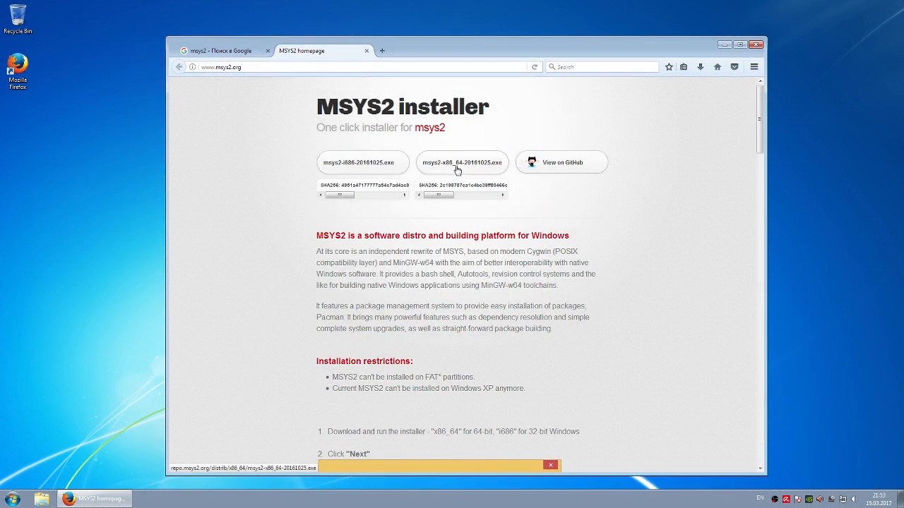

  [MSYS2](http://msys2.org) is a software distro and building platform
  for Windows.

  We use MSYS2 to build and install OpenSceneGraph, because it provides
  Unix-like environment with everything that is necessary to
  build Windows applications: Git, CMake, GCC and a lot more.

<a name="step-download-msys2"/>

1.3.2. Download MSYS2
-------------------------------------

  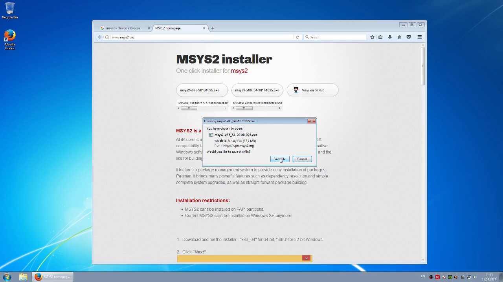

  Choose package suitable for your version of Windows.
  In case of 64-bit Windows, it's MSYS2 **x86_64**.

<a name="step-install-msys2"/>

1.3.3. Install MSYS2
-------------------------------------

  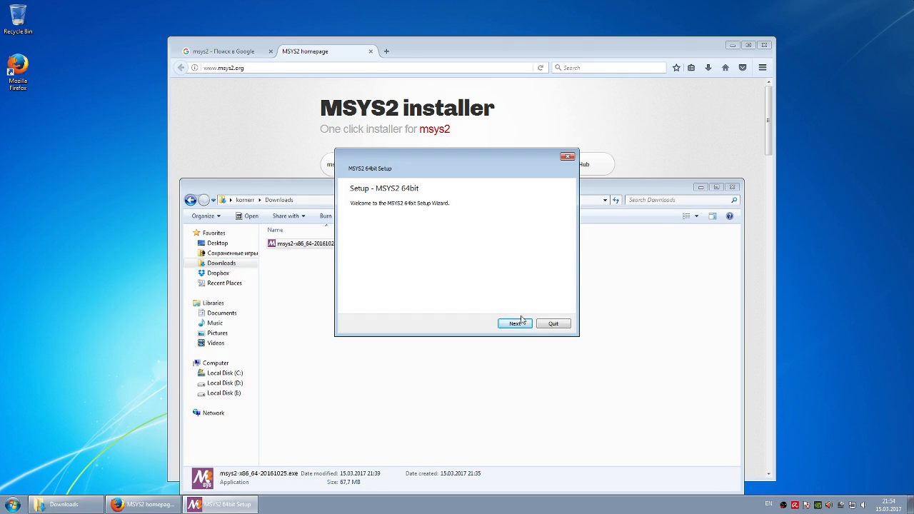

  Run the downloaded package.

<a name="step-update-msys2-core"/>

1.3.4. Update MSYS2 core packages
---------------------------------

  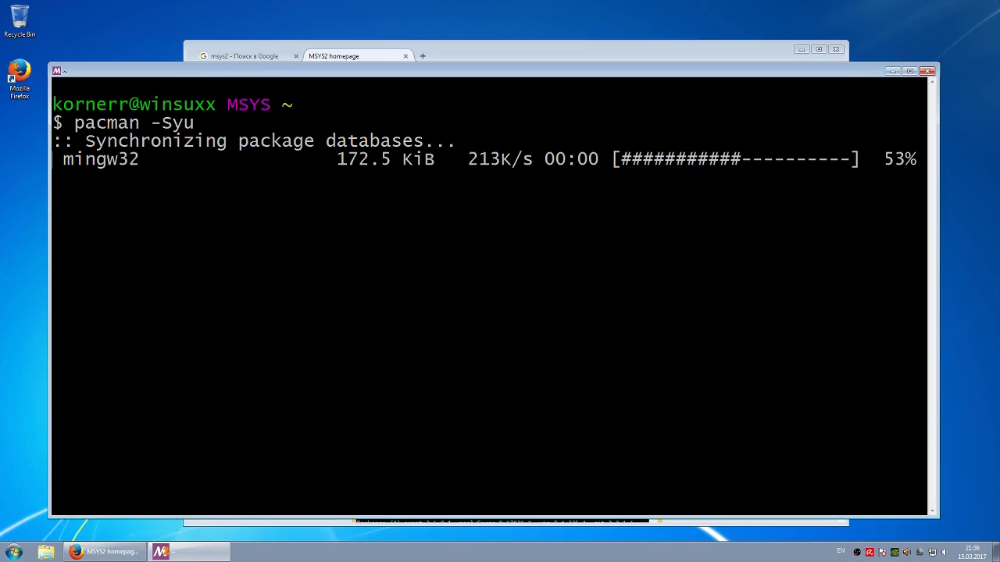

  Run the following command in MSYS2:

  `pacman -Syu`

  Once finished, close MSYS2.

<a name="step-update-msys2-system"/>

1.3.5. Update MSYS2 system packages
-----------------------------------

  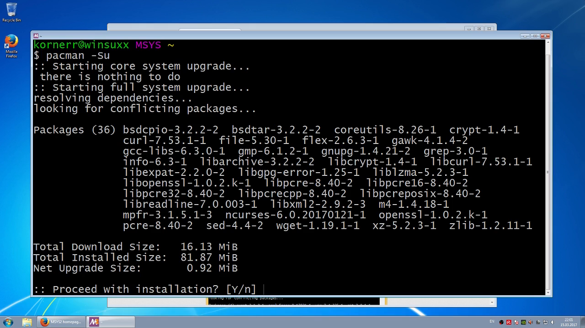

  Reopen MSYS2 and run the following command:

  `pacman -Su`

  Now, MSYS2 is ready for us.

<a name="step-find-cmake"/>

1.3.6. Find MinGW-w64 CMake
-----------------------------------

  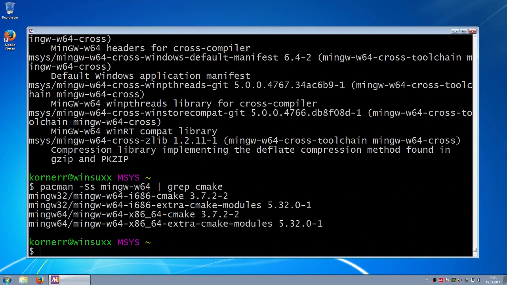

  In order to build Windows applications, we need to use MinGW-w64 tools.
  [MinGW-w64](http://mingw-w64.org) is an advancement of the original
  [MinGW](http://mingw.org) project, created to support the GCC compiler on
  Windows.

  To find relevant CMake package, run the following command:

  `pacman -Ss mingw-w64 | grep cmake`

<a name="step-install-build-tools"/>

1.3.7. Install build tools
--------------------------

  

  To install CMake, Make, and GCC, run the following command:

  `pacman -S mingw-w64-i686-cmake mingw-w64-i686-make mingw-w64-i686-gcc`

  We use 32-bit versions, because we want to build 32-bit OpenSceneGraph,
  which would work on both 32- and 64-bit Windows.

<a name="step-find"/>

1.3.8. Find OpenSceneGraph repository
-------------------------------------

  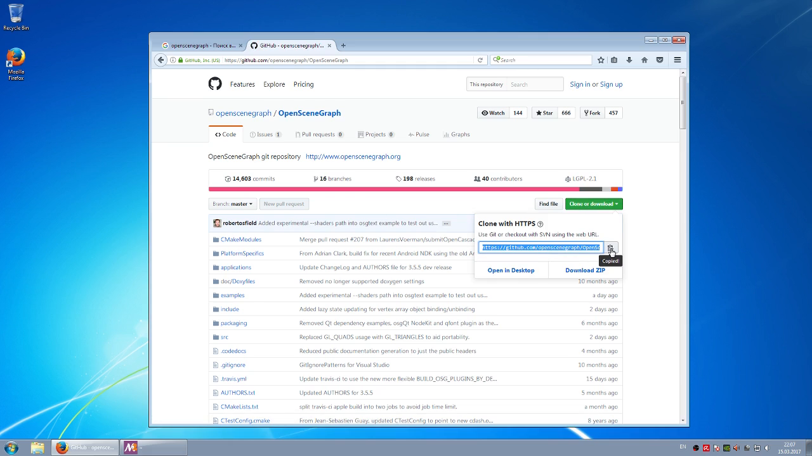

  Find OpenSceneGraph repository at the website.

<a name="step-install-git"/>

1.3.9. Install git to get OpenSceneGraph
----------------------------------------

  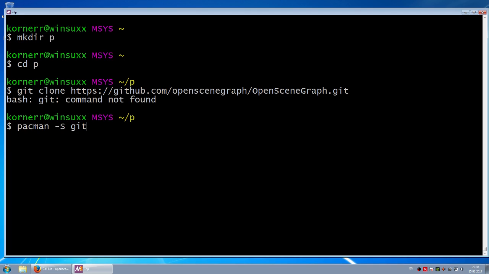

  Since [OpenSceneGraph is hosted at GitHub](https://github.com/openscenegraph/OpenSceneGraph),
  we need to install git.

  To install git, run the following command:

  `pacman -S git`

<a name="step-get-osg"/>

1.3.10. Get latest OpenSceneGraph
---------------------------------

  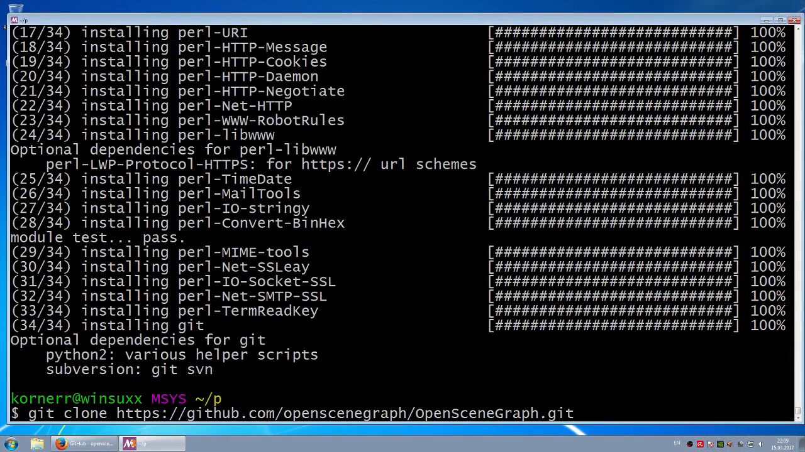

  Get the latest copy of OpenSceneGraph with the following command:

  `git clone https://github.com/openscenegraph/OpenSceneGraph.git`

<a name="step-build-dir"/>

1.3.11. Create build directory
------------------------------

  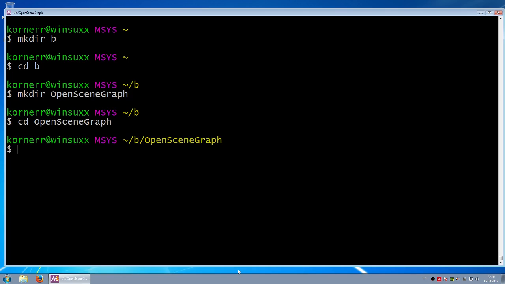
  
  OpenSceneGraph uses CMake build system, which supports out-of-source builds.
  We create a build directory to keep generated (built) content separate
  from the original source.

<a name="step-try-cfg"/>

1.3.12. Try to configure OpenSceneGraph with CMake
--------------------------------------------------

  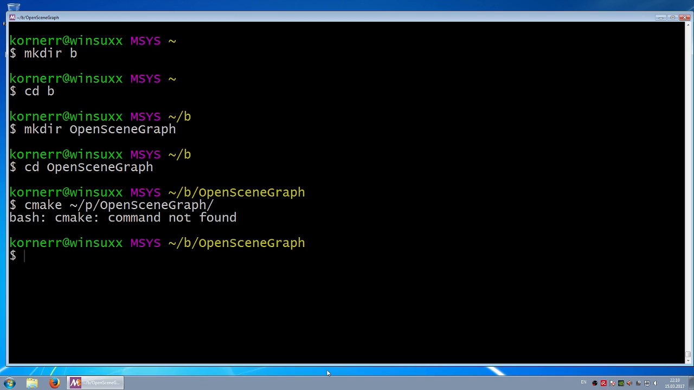

  Before we can build OpenSceneGraph, we need to configure the build.

  However, CMake is not yet reachable.

<a name="step-path"/>

1.3.13. Add MinGW-w64 bin directory to PATH
-------------------------------------------

  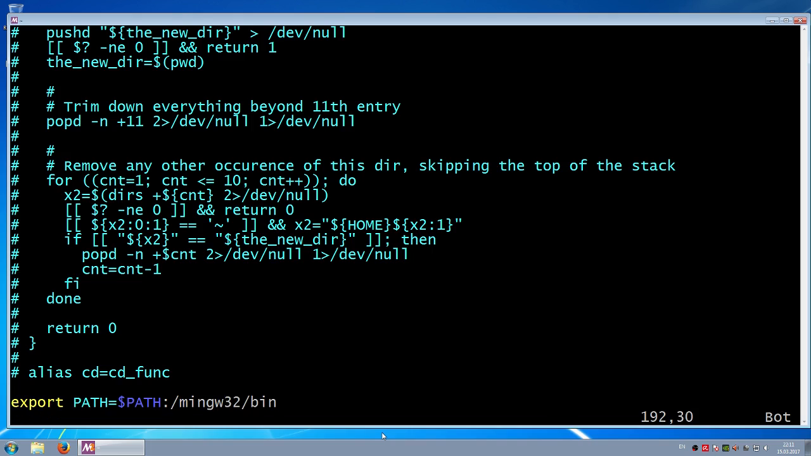

  CMake is not yet reachable, because it's a MinGW package. MinGW
  packages reside in a non-standard path.

  To make MinGW CMake (and other MinGW executables) accessible, we need to
  add MinGW bin directory to PATH environment variable.
  Do it by appending the following line:

  `export PATH=$PATH:/mingw32/bin`

  to `~/.bashrc` file.

  Restart MSYS2 for the changes to take effect.

<a name="step-cfg-2"/>

1.3.14. Try to configure OpenSceneGraph once again
--------------------------------------------------

  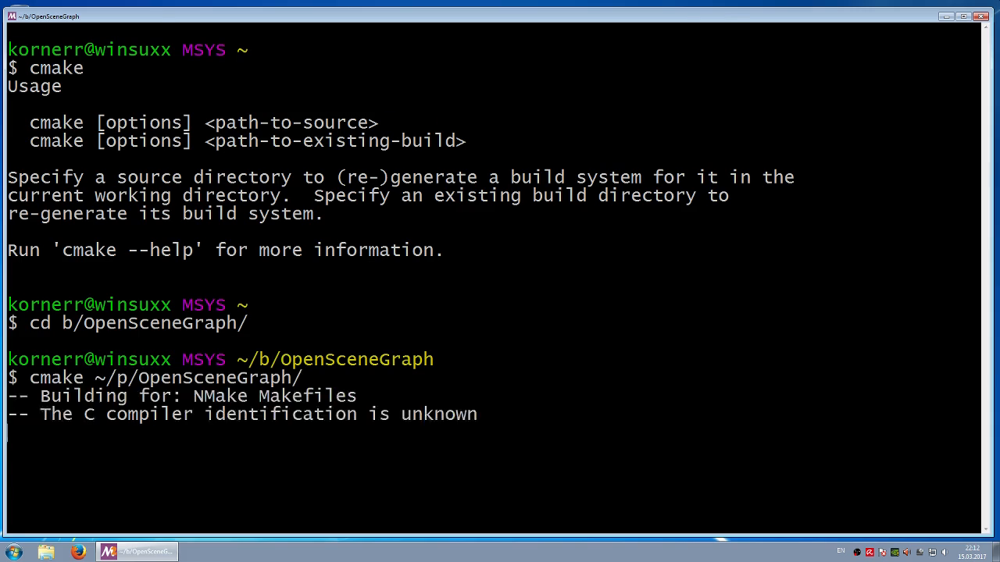

  Try to configure OpenSceneGraph build with the following commands:
 
  `cd /path/to/build/dir`

  `cmake /path/to/source/dir`

  We use default configuration without specifying anything.

<a name="step-cfg-2-observe"/>

1.3.15. Observe configuration errors
------------------------------------

  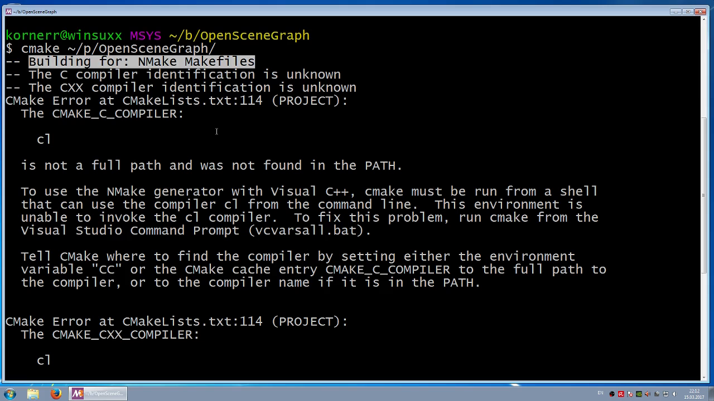

  As you see, configuration process could not find valid compiler for
  **NMake Makefiles**. That's because **NMake Makefiles** are for
  Visual Studio, but we use MinGW's GCC.

<a name="step-cfg-3"/>

1.3.16. Try to configure OpenSceneGraph for MinGW
-------------------------------------------------

  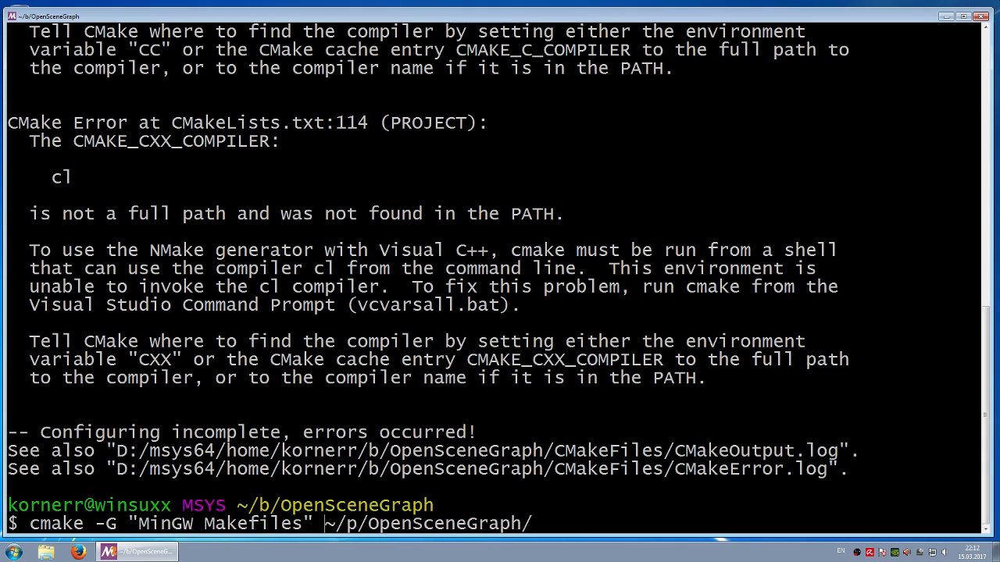

  Since we want to use MinGW's GCC, we need to tell CMake to generate
  **MinGW Makefiles**. We do it by adding `-G "MinGW Makefiles"` to the
  configuration command:

  `cmake -G "MinGW Makefiles" ~/p/OpenSceneGraph`

<a name="step-cfg-3-observe"/>

1.3.17. Observe generator error
-------------------------------

  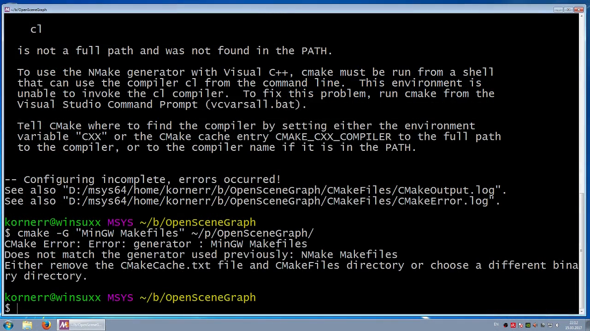

  CMake complains about using a generator that is different from
  the one used before.

<a name="step-cfg-3-clean"/>

1.3.18. Clean build directory
-----------------------------
  
  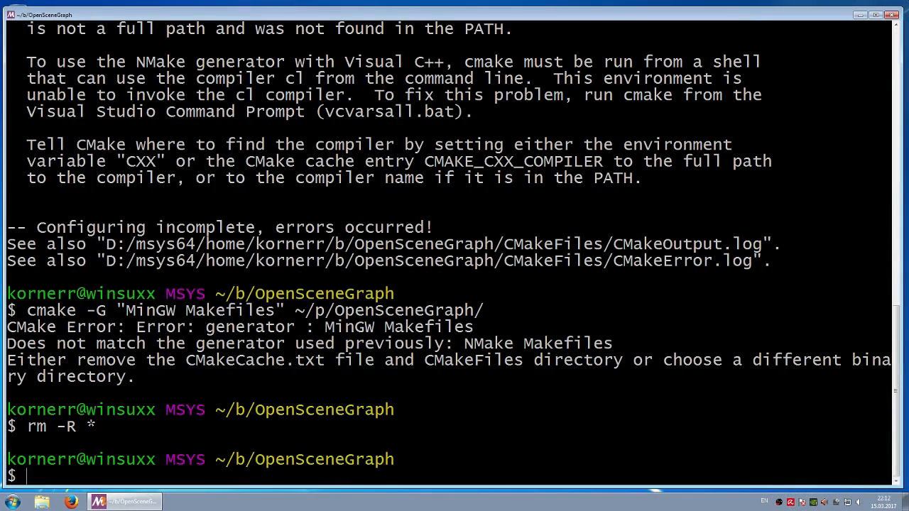

  To fix generator error, we need to clean build directory with the following commands:

  `cd /path/to/build/dir`

  `rm -R *`

  **Warning**: make sure you run `rm` command from the build directory only! This
  command removes all files in the current directory and descendant ones.

<a name="step-cfg-4"/>

1.3.19. Try to configure OpenSceneGraph for MinGW once again
------------------------------------------------------------

  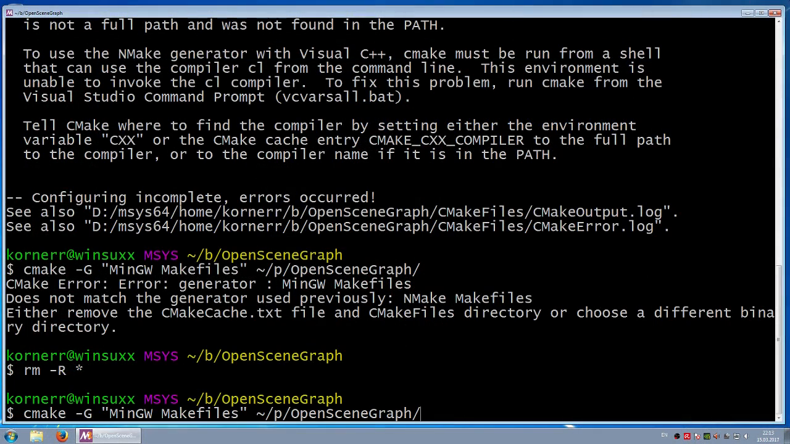

  Configure OpenSceneGraph for MinGW once again.

<a name="step-cfg-4-observe"/>

1.3.20. Observe sh error
------------------------

  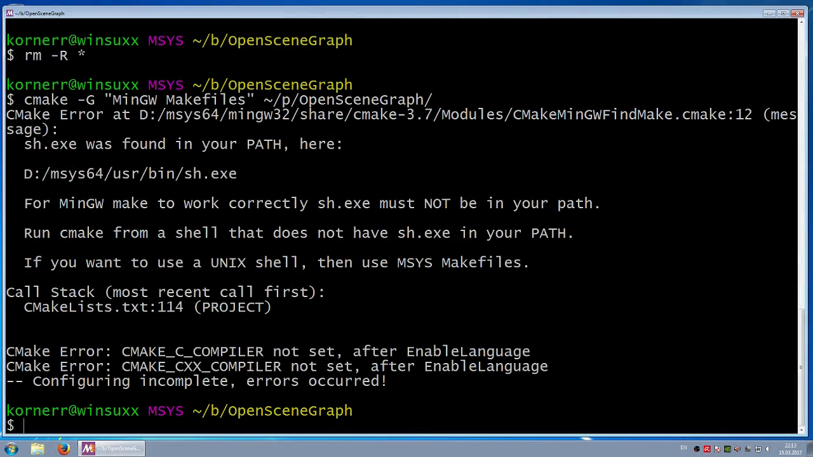

  CMake complains about `sh.exe` presence in PATH. As we seen before, MinGW
  resides in a non-standard path to make sure MinGW executables do not
  conflict with [Cygwin](http://cygwin.org) executables.

  Since MSYS2 uses Cygwin underneath, CMake detected MinGW and Cygwin mix.

<a name="step-update-cmake-script"/>

1.3.21. Update CMake MinGW script
---------------------------------

  

  Since we only installed MinGW build tools, we can remove `sh.exe`
  check by commenting out relevant lines in
  `/mingw32/share/cmake-*/Modules/CMakeMinGWFindMake.cmake` file.

<a name="step-cfg"/>

1.3.22. Configure OpenSceneGraph
--------------------------------

  

  Configure OpenSceneGraph once again. There are no more errors.

<a name="step-build"/>

1.3.23. Build OpenSceneGraph
----------------------------

  

  We are finally ready to build OpenSceneGraph with the following command:

  `mingw32-make -j10`

  We use `-j10` to run 10 parallel jobs. This makes building faster.

<a name="step-try-install"/>

1.3.24. Try to install OpenSceneGraph
------------------------------

  

  Try to install with the following commands:

  `cd /path/to/build/dir`

  `mingw32-make install`

<a name="step-observe-install"/>

1.3.25. Observe installation error
----------------------------------

  

  Installation failed, because MSYS2 needs administrative privileges to
  install OpenSceneGraph into `C:\Program Files (x86)`.

<a name="step-install"/>

1.3.26. Install OpenSceneGraph
------------------------------

  

  Restart MSYS2 with administrative privelegies and run the following commands:

  `cd /path/to/build/dir`

  `mingw32-make install`

<a name="step-try-osgviewer"/>

1.3.27. Try to run 'osgviewer'
------------------------------

  

  Go to `C:\Program Files (x86)\OpenSceneGraph`, which contains OpenSceneGraph
  installation.

  Try to run 'osgviewer' from `bin` subdirectory.

<a name="step-missing-library"/>

1.3.28. Observe missing library
-------------------------------

  

  You cannot run 'osgviewer' at this time, because it misses several libraries.

  Those libraries are part of MinGW installation. However, since they reside
  in non-standard place, 'osgviewer' executable can't find them.

<a name="step-find-libraries"/>

1.3.29. Find MinGW libraries
------------------------------------

  

  The easiest way to locate MinGW installation directory, is to run the
  following command from within MSYS2:

  `explorer .`

  This will open your current directory in Explorer.

  From there, you can navigate to `mingw32/bin` directory.
  This is the place where MinGW libraries reside.

<a name="step-copy-libraries"/>

1.3.30. Copy MinGW libraries
----------------------------

  

  Copy all files with `dll` extension to the directory, where `osgviewer`
  resides.

  **Note**: you don't really need all MinGW libraries. We copy all libraries
  just to keep this tutorial simpler.

<a name="step-go-osgviewer"/>

1.3.31. Go to the directory with 'osgviewer'
-----------------------------------------

  

  With MSYS2, go to `C:\Program Files (x86)\OpenSceneGraph\bin`, where
  `osgviewer` resides.

<a name="step-check"/>

1.3.32. Check 'box.osgt' with 'osgviewer'
-----------------------------------------

  

  Finally, take a look at the cube with `osgviewer`:

  `./osgviewer /path/to/box.osgt`

