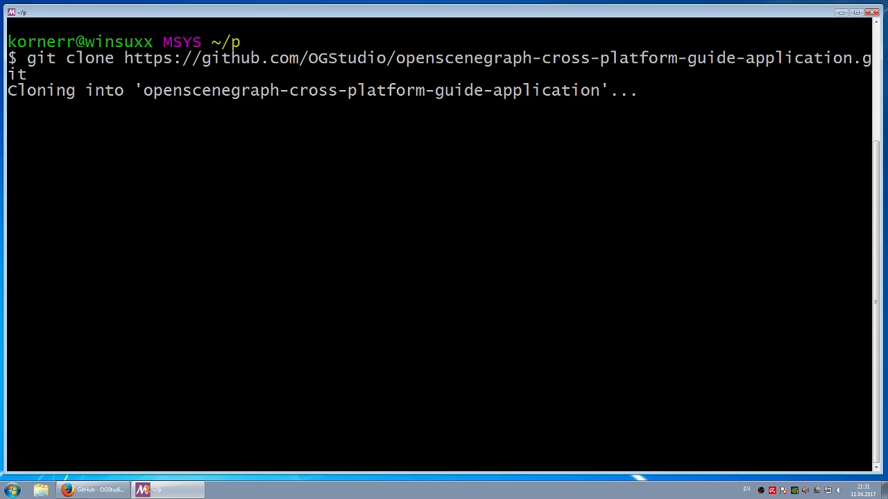
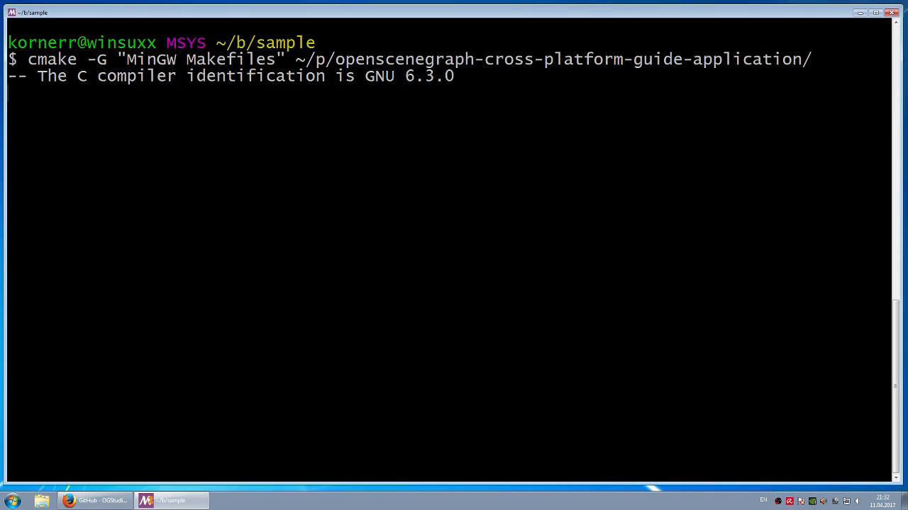
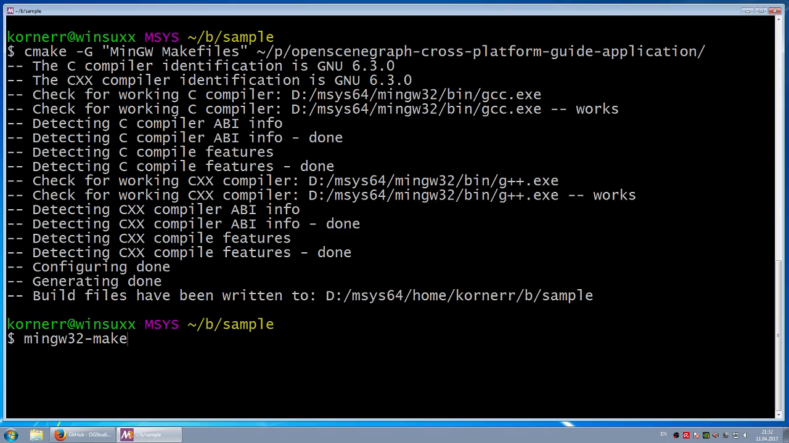
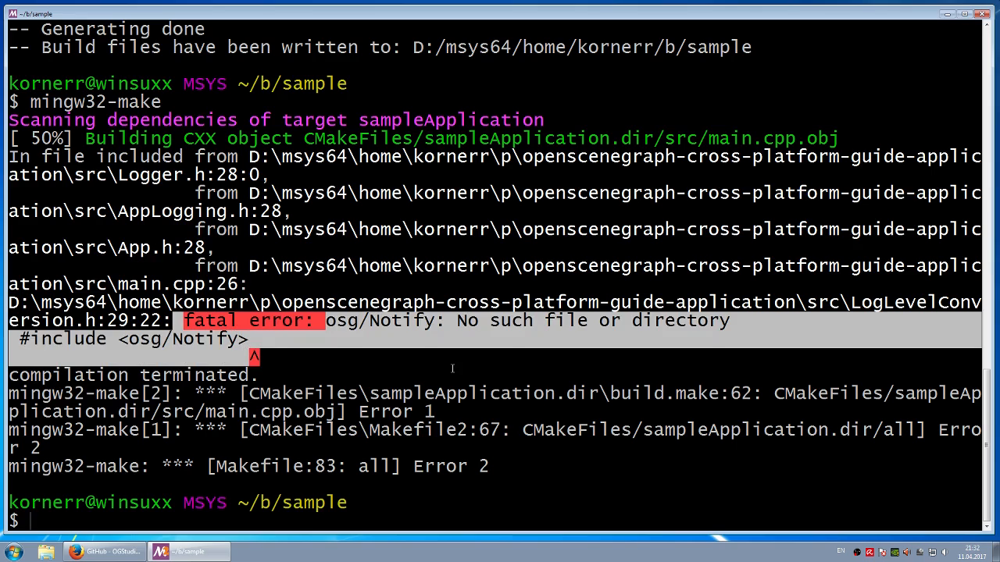
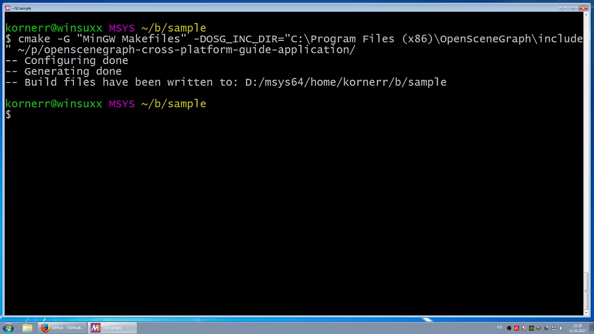
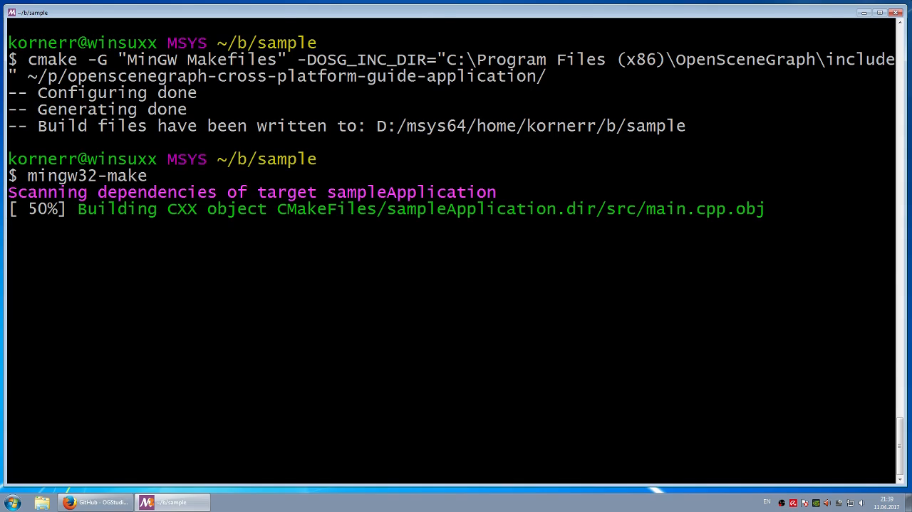
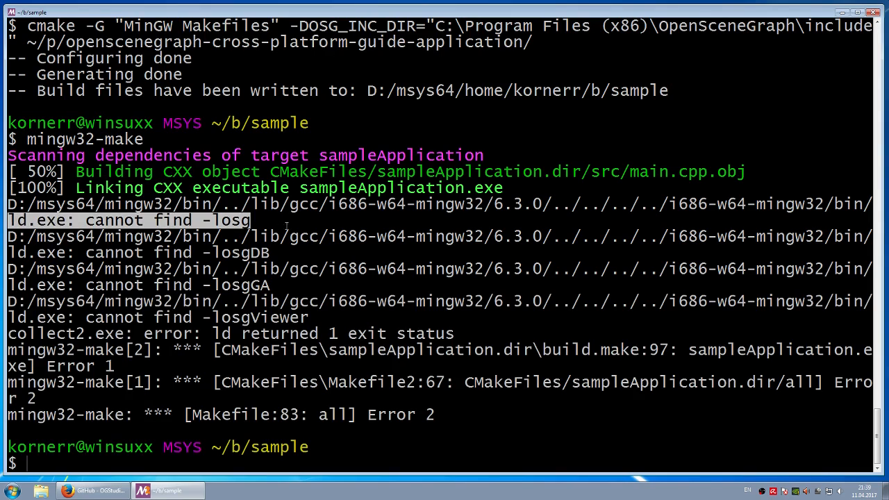
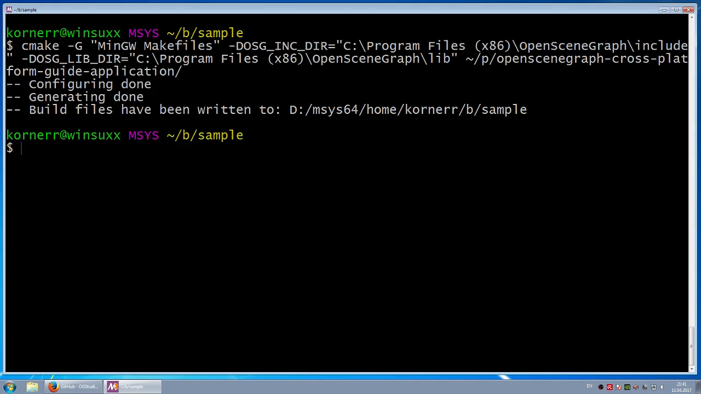
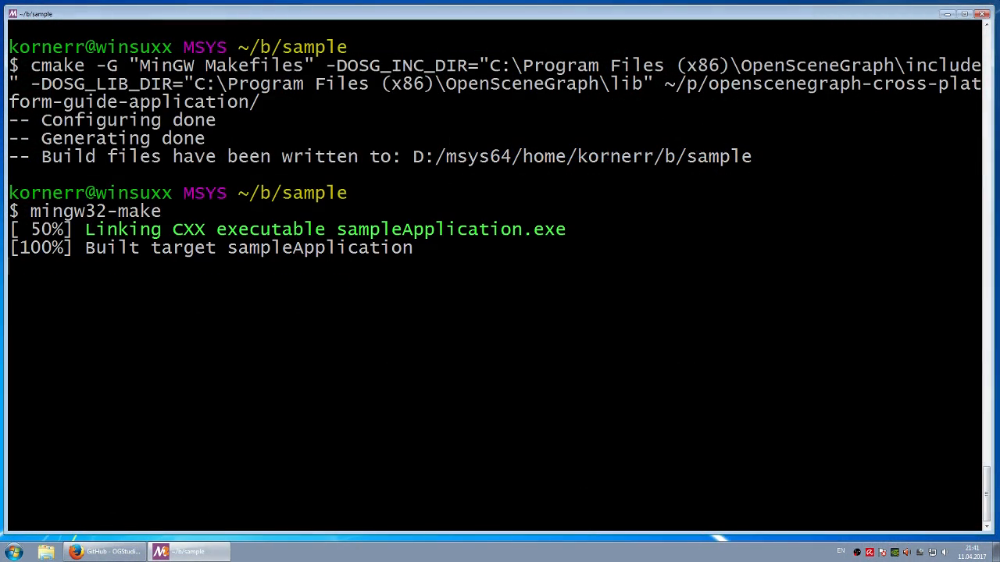
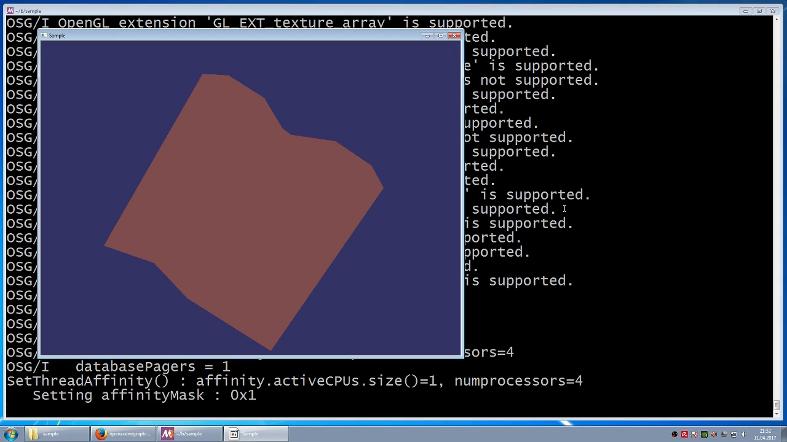

Table of contents
=================

* [Overview](#overview)
* [Video](#video)
* [Steps](#steps)
  * [1.6.1. Get sample application](#step-get)
  * [1.6.2. Create build directory](#step-build-dir)
  * [1.6.3. Configure the build](#step-cfg)
  * [1.6.4. Try to build application](#step-try-build)
  * [1.6.5. Observe build error](#step-build-error)
  * [1.6.6. Find OpenSceneGraph include directory](#step-find-osg-dir)
  * [1.6.7. Reconfigure with OSG include directory](#step-cfg-inc)
  * [1.6.8. Try to build application once again](#step-try-build-again)
  * [1.6.9. Observe another build error](#step-link-error)
  * [1.6.10. Reconfigure with OSG include and library directories](#step-cfg-all)
  * [1.6.11. Build application](#step-build)
  * [1.6.12. Try to run application](#step-try-run)
  * [1.6.13. Observe missing library](#step-run-lib)
  * [1.6.14. Copy OSG libraries](#step-copy-lib)
  * [1.6.15. Run application](#step-run)

<a name="overview"/>

Overview
========

This tutorial is part of [OpenSceneGraph cross-platform guide](http://github.com/OGStudio/openscenegraph-cross-platform-guide).

In this tutorial we build and run
[sample OpenSceneGraph application](http://github.com/OGStudio/openscenegraph-cross-platform-guide-application)
under Windows. The application displays provided model with simple GLSL shaders.

**Note**: this tutorial requires
* OpenSceneGraph installation (see [1.2. Install OpenSceneGraph under Windows](../1.3.InstallUnderWindows))
* OpenSceneGraph model (see [1.1. Create a cube](../1.1.CreateCube))

<a name="video"/>

Video
=====

[YouTube](todo) | [Download](readme/video.mp4)

Video depicts running and building sample OpenSceneGraph application
under 64-bit Windows 7.

<a name="steps"/>

Steps
=====

**Note**: steps below use frames from the video as screenshots.
Watch the video to see all details.

<a name="step-get"/>

1.6.1. Get sample application
-----------------------------

  

  Get the latest copy of sample application with the following command:

  `git clone https://github.com/OGStudio/openscenegraph-cross-platform-guide-application.git`

<a name="step-build-dir"/>

1.6.2. Create build directory
-----------------------------

  

  Create a separate build directory for sample application, just as you did for
  OpenSceneGraph.

<a name="step-cfg"/>

1.6.3. Configure the build
--------------------------

  

  Configure sample application build with the following commands:
 
  `cd /path/to/build/dir`

  `cmake -G "MinGW Makefiles" /path/to/source/dir`

<a name="step-try-build"/>

1.6.4. Try to build application
-------------------------------

  

  Try to build application with the following command:

  `mingw32-make`

<a name="step-build-error"/>

1.6.5. Observe build error
--------------------------

  

  Building process could not find one of OpenSceneGraph headers, because
  OpenSceneGraph is installed in a non-standard directory.
  
<a name="step-find-osg-dir"/>

1.6.6. Find OpenSceneGraph include directory
--------------------------------------------

  

  Locate OpenSceneGraph include directory and copy its path.

<a name="step-cfg-inc"/>

1.6.7. Reconfigure with OSG include directory
---------------------------------------------

  

  Reconfigure sample application build with the following command:
 
  `cmake -G "MinGW Makefiles" -DOSG_INC_DIR="C:\Program Files (x86)\OpenSceneGraph\include" /path/to/source/dir`

  Application's CMake file uses `OSG_INC_DIR` to search for additional headers.

<a name="step-try-build-again"/>

1.6.8. Try to build application once again
------------------------------------------

  

  Try to build application with the following command once again:

  `mingw32-make`

<a name="step-link-error"/>

1.6.9. Observe another build error
----------------------------------

  

  Building process could not find OpenSceneGraph libraries, because
  OpenSceneGraph is installed in a non-standard directory.

<a name="step-cfg-all"/>

1.6.10. Reconfigure with OSG include and library directories
------------------------------------------------------------

  

  Reconfigure sample application build with the following command:
 
  `cmake -G "MinGW Makefiles" -DOSG_INC_DIR="C:\Program Files (x86)\OpenSceneGraph\include" -DOSG_LIB_DIR="C:\Program Files (x86)\OpenSceneGraph\lib" /path/to/source/dir`

  Application's CMake file uses `OSG_LIB_DIR` to search for additional libraries.

<a name="step-build"/>

1.6.11. Build application
------------------------

  

  Build sample application with the following command:

  `mingw32-make`

<a name="step-try-run"/>

1.6.12. Try to run application
------------------------------

  

  Try to run sample application.

<a name="step-run-lib"/>

1.6.13. Observe missing library
-------------------------------

  

  Sample application cannot be run, because it cannot find
  OpenSceneGraph libraries.

<a name="step-copy-lib"/>

1.6.14. Copy OSG libraries
--------------------------

  

  Copy osgPlugins directory and all files with `dll` extension to the directory,
  where sample application resides. 

  **Note**: you don't really need all OpenSceneGraph libraries. We copy all
  libraries just to keep this tutorial simpler.

<a name="step-run"/>

1.6.15. Run application
-----------------------

  

  Run sample application with the following command:

  `./sampleApplication /path/to/box.osgt`

