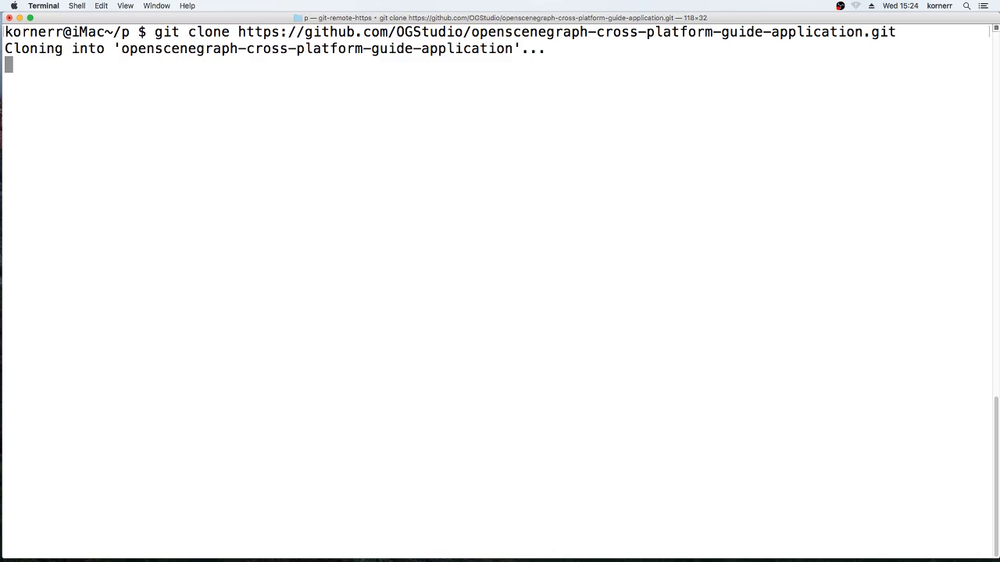
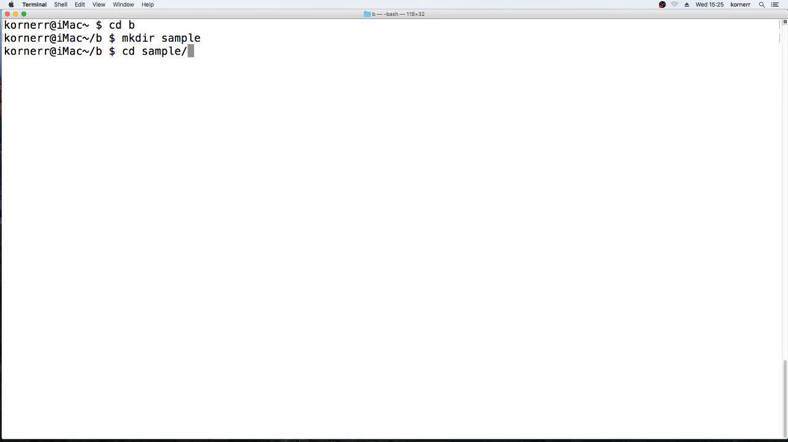
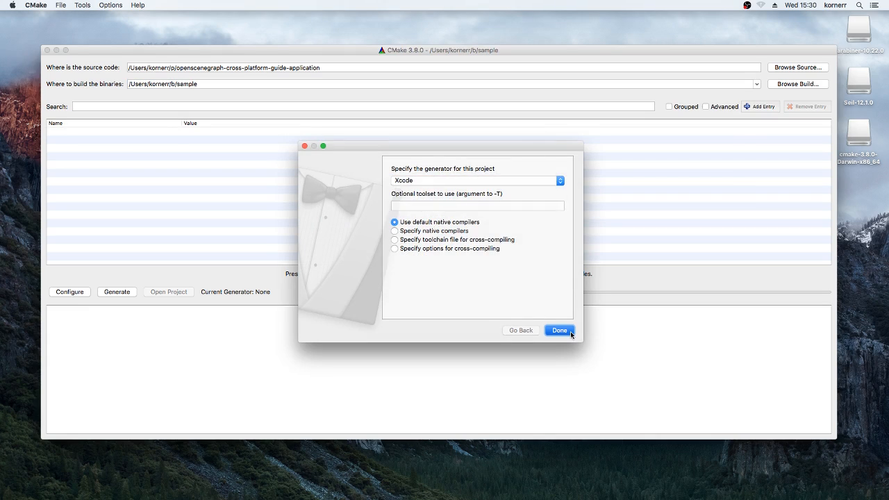
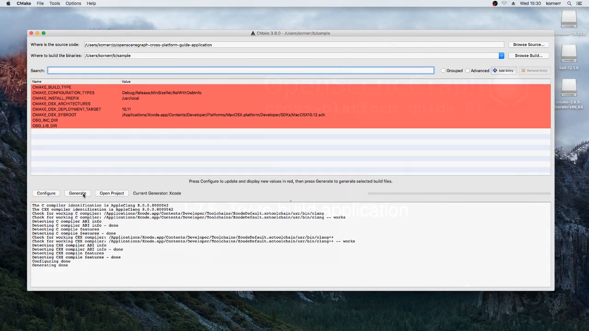
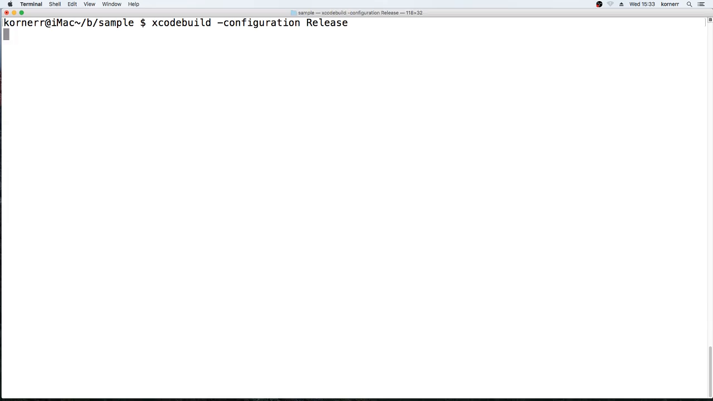
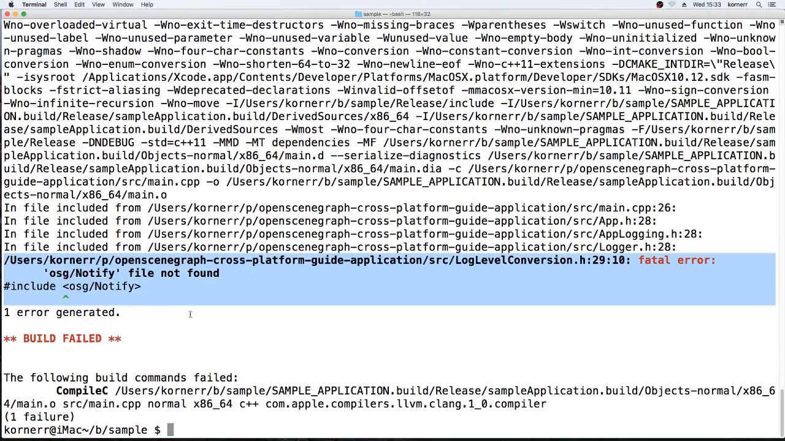
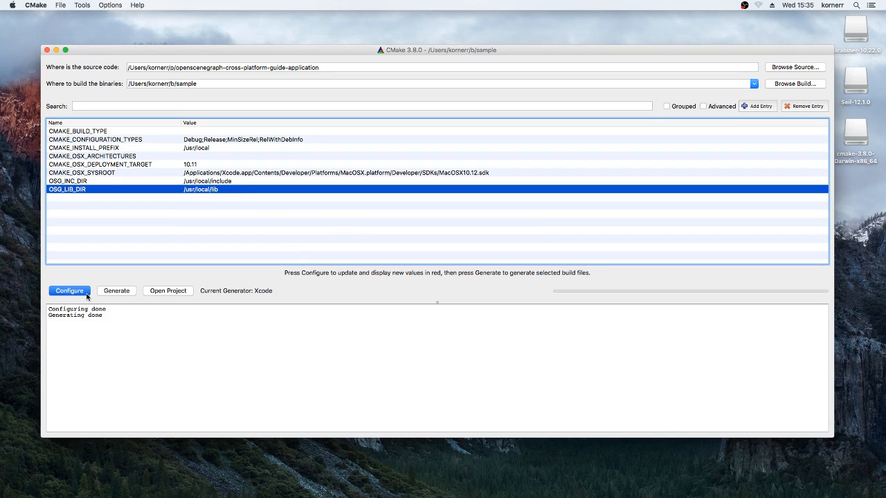
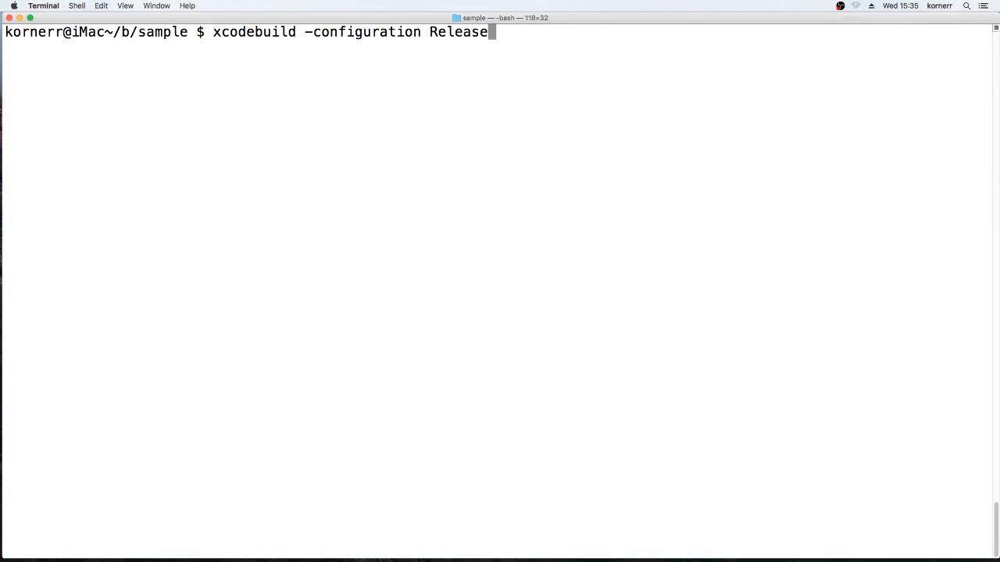
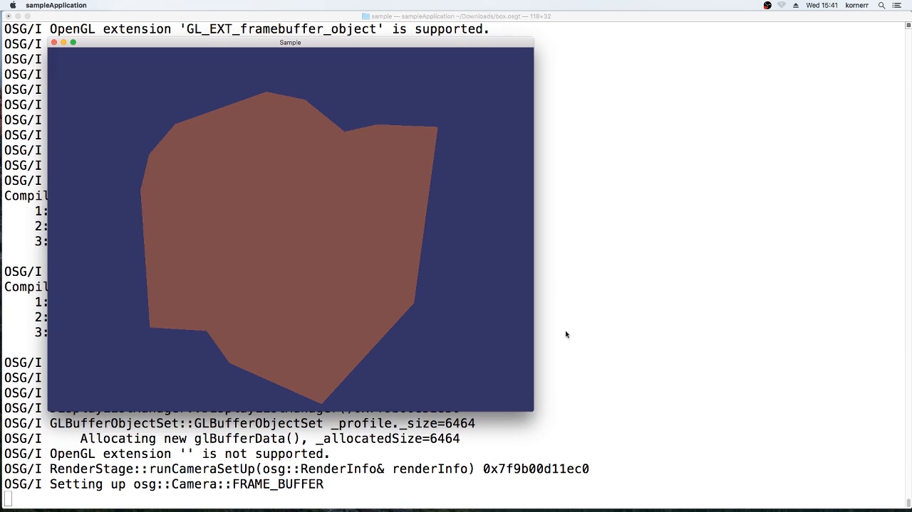

Table of contents
=================

* [Overview](#overview)
* [Video](#video)
* [Steps](#steps)
  * [1.7.1. Get sample application](#step-get)
  * [1.7.2. Create build directory](#step-build-dir)
  * [1.7.3. Configure the build](#step-cfg)
  * [1.7.4. Generate Xcode project file](#step-generate)
  * [1.7.5. Try to build application](#step-try-build)
  * [1.7.6. Observe build error](#step-build-error)
  * [1.7.7. Reconfigure with OSG include and library directories](#step-cfg-all)
  * [1.7.8. Regenerate Xcode project file](#step-regenerate)
  * [1.7.9. Build application](#step-build)
  * [1.7.10. Run application](#step-run)

<a name="overview"/>

Overview
========

This tutorial is part of [OpenSceneGraph cross-platform guide](http://github.com/OGStudio/openscenegraph-cross-platform-guide).

In this tutorial we build and run
[sample OpenSceneGraph application](http://github.com/OGStudio/openscenegraph-cross-platform-guide-application)
under macOS. The application displays provided model with simple GLSL shaders.

**Note**: this tutorial requires
* OpenSceneGraph model (see [1.1. Create a cube](../1.1.CreateCube))
* OpenSceneGraph installation (see [1.4. Install OpenSceneGraph under macOS](../1.4.InstallUnderMacOS))

<a name="video"/>

Video
=====

[YouTube](https://youtu.be/i0kUMSP20VA) | [Download](readme/video.mp4)

Video depicts running and building sample OpenSceneGraph application
under macOS El Capitan (10.11).

<a name="steps"/>

Steps
=====

**Note**: steps below use frames from the video as screenshots.
Watch the video to see all details.

<a name="step-get"/>

1.7.1. Get sample application
-----------------------------

  

  Get the latest copy of sample application with the following command:

  `git clone https://github.com/OGStudio/openscenegraph-cross-platform-guide-application.git`

<a name="step-build-dir"/>

1.7.2. Create build directory
-----------------------------

  

  Create a separate build directory for sample application, just as you did for
  OpenSceneGraph.

<a name="step-cfg"/>

1.7.3. Configure the build
--------------------------

  

  Specify build and source directories in CMake GUI, then press `Configure`.

  Make sure to select `Xcode` generator when prompted.

<a name="step-generate"/>

1.7.4. Generate Xcode project file
-----------------------------------

  

  Press `Generate` to generate Xcode specific project file.

<a name="step-try-build"/>

1.7.5. Try to build application
-------------------------------

  

  Try to build application with the following command:

  `xcodebuild -configuration Release`

  You may remember that we specified `-target install` during OpenSceneGraph
  building. Since sample application has no `install` target, we don't need
  to specify any `target`.

<a name="step-build-error"/>

1.7.6. Observe build error
--------------------------

  

  Building process could not find one of OpenSceneGraph headers, because
  OpenSceneGraph is installed in a non-standard directory.
  
<a name="step-cfg-all"/>

1.7.7. Reconfigure with OSG include and library directories
------------------------------------------------------------

  

  Since OpenSceneGraph has been installed into `/usr/local` directory,
  OpenSceneGraph header are located in `/usr/local/include` and libraries
  in `/usr/local/lib`. Specify these paths into `OSG_INC_DIR` and
  `OSG_LIB_DIR` variables correspondingly.

  Application's CMake file uses `OSG_INC_DIR` to search for additional headers
  and `OSG_LIB_DIR` to search for additional libraries.

<a name="step-regenerate"/>

1.7.8. Regenerate Xcode project file
------------------------------------

  

  Press `Generate` to regenerate Xcode specific project file.

<a name="step-build"/>

1.7.9. Build application
------------------------

  

  Build sample application with the following command:

  `xcodebuild -configuration Release`

<a name="step-run"/>

1.7.10. Run application
-----------------------

  

  Run sample application with the following command:

  `./Release/sampleApplication /path/to/box.osgt`

  **Note**: since we built `Release` configuration, binaries have been placed
  inside `Release` directory.

