Table of contents
=================

* [Overview](#overview)
* [Video](#video)
* [Steps](#steps)
  * [1.8.1. Download Android Studio](#step-dl-as)
  * [1.8.2. Install 32-bit libraries](#step-32-libs)
  * [1.8.3. Unpack Android Studio](#step-unpack-as)
  * [1.8.4. Run Android Studio](#step-run-as)
  * [1.8.5. Select standard installation options](#step-install-as)
  * [1.8.6. Wait for components to install](#step-wait-as)
  * [1.8.7. Run SDK Manager](#step-run-sdk)
  * [1.8.8. Select CMake, LLDB, NDK components](#step-select-ndk)
  * [1.8.9. Accept license](#step-license)
  * [1.8.10. Wait for CMake, LLDB, NDK to install](#step-wait-ndk)
  * [1.8.11. Start Android code sample import](#step-import)
  * [1.8.12. Import 'Hello GL2' sample](#step-import-gl2)
  * [1.8.13. Try to run 'Hello GL2' sample](#step-try-run-gl2)
  * [1.8.14. Start AVD creation](#step-start-avd)
  * [1.8.15. Select device definition](#step-definition)
  * [1.8.16. Download system image](#step-dl-img)
  * [1.8.17. Select system image](#step-select-img)
  * [1.8.18. Select software graphics renderer](#step-software-gfx)
  * [1.8.19. Run 'Hello GL2' sample](#step-run-gl2)
  * [1.8.20. Observe 'Hello GL2' sample](#step-observe-gl2)
  * [1.8.21. Start a new Android Studio project](#step-start-project)
  * [1.8.22. Include C++ support](#step-cpp-support)
  * [1.8.23. Select empty activity](#step-empty-activity)
  * [1.8.24. Turn on C++11, exceptions, and RTTI](#step-cpp11)
  * [1.8.25. Run the project](#step-run-stub)
  * [1.8.26. Clone OSG alongside the project](#step-osg)
  * [1.8.27. Clone sample OSG application alongside the project](#step-osg-app)
  * [1.8.28. Copy Android part into the project](#step-copy)
  * [1.8.29. Update RenderActivity](#step-render-activity)
  * [1.8.30. Update AndroidManifest](#step-manifest)
  * [1.8.31. Update CMakeLists](#step-cmake)
  * [1.8.32. Specify target ABIs](#step-abi)
  * [1.8.33. Build the project](#step-build)
  * [1.8.34. Try to run the project](#step-run)
  * [1.8.35. Observe error](#step-error)
  * [1.8.36. Fix osgNativeLib reference](#step-fix)
  * [1.8.37. Run the project](#step-result)

<a name="overview"/>

Overview
========

This tutorial is part of [OpenSceneGraph cross-platform guide](http://github.com/OGStudio/openscenegraph-cross-platform-guide).

In this tutorial we build and run
[sample OpenSceneGraph application](http://github.com/OGStudio/openscenegraph-cross-platform-guide-application)
under Android. The application displays provided model with simple GLSL shaders.

**Note**: this tutorial requires OpenSceneGraph model
(see [1.1. Create a cube](../1.1.CreateCube))

<a name="video"/>

Video
=====

[YouTube](todo) | [Download](readme/video.mp4)

Video depicts running and building sample OpenSceneGraph application
with Android Studio 2.3.1 under Xubuntu 16.04.

<a name="steps"/>

Steps
=====

**Note**: steps below use frames from the video as screenshots.
Watch the video to see all details.

<a name="step-dl-as"/>

1.8.1. Download Android Studio
------------------------------

  

  Download the latest version of Android Studio.
  It contains all the tools you need to develop for Android.

<a name="step-32-libs"/>

1.8.2. Install 32-bit libraries
-------------------------------

  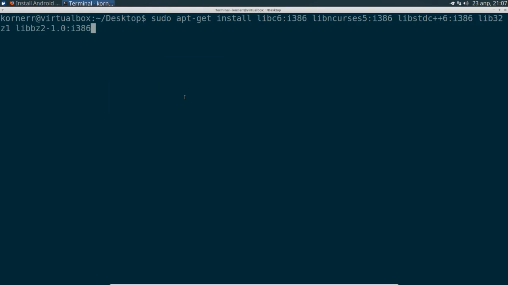

  According to [Android Studio installation instructions](https://developer.android.com/studio/install.html)
  64-bit Ubuntu needs several 32-bit libraries to make Android Studio work.

  Install necessary 32-bit libraries with the following command:

  `sudo apt-get install libc6:i386 libncurses5:i386 libstdc++6:i386 lib32z1 libbz2-1.0:i386`

<a name="step-unpack-as"/>

1.8.3. Unpack Android Studio
----------------------------

  

  Extract Android Studio archive into your home directory.

<a name="step-cfg-as"/>

1.8.4. Run Android Studio
-------------------------------

  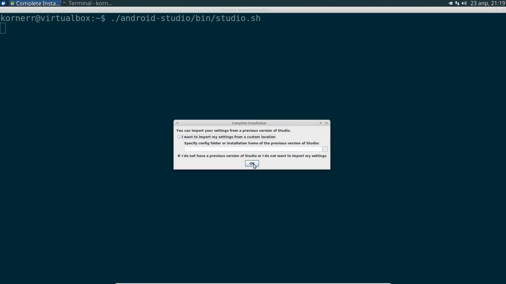

  Run Android Studio with the following commands:

  `cd ~`

  `./android-studio/bin/studio.sh`

<a name="step-install-as"/>

1.8.5. Select standard installation options
-------------------------------------------

  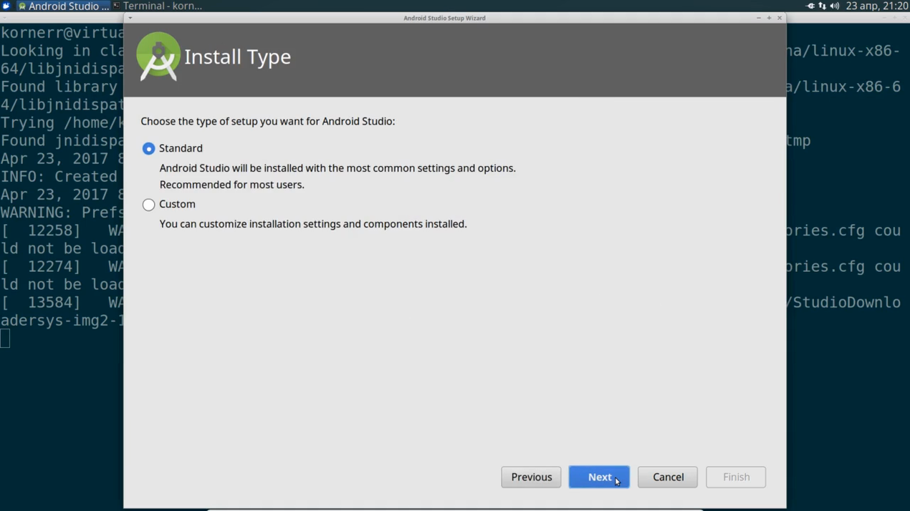

  Select standard installation options.

<a name="step-wait-as"/>

1.8.6. Wait for components to install
-------------------------------------

  

  Wait for standard components to install.

<a name="step-run-sdk"/>

1.8.7. Run SDK Manager
----------------------

  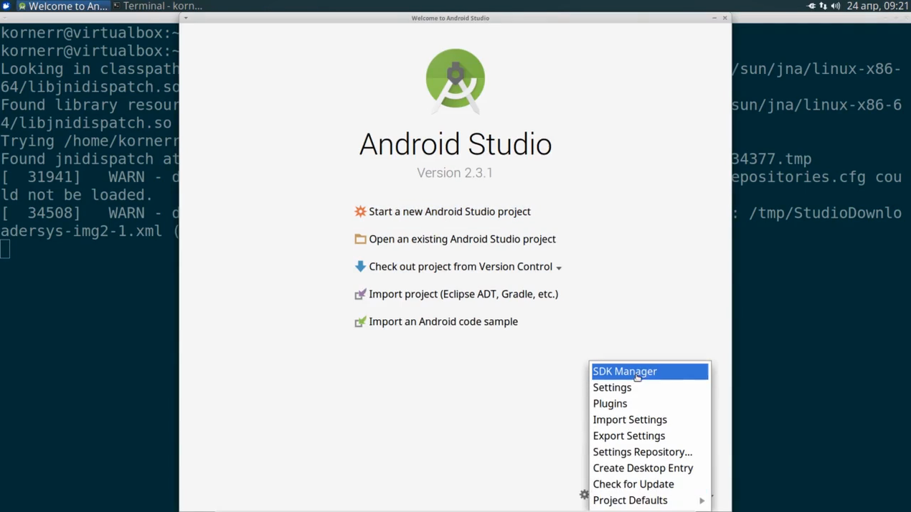

  Select *Configure* -> *SDK Manager* to run *SDK Manager*, which 
  we will use to install additional components.

<a name="step-install-ndk"/>

1.8.8. Select CMake, LLDB, NDK components
-----------------------------------------

  

  We need CMake, LLDB, and NDK components to build C++ for Android.

  Select them in *SDK Tools* tab of *SDK Manager*.

<a name="step-license"/>

1.8.9. Accept license
---------------------

  

  To install CMake, LLDB, and NDK, we need to accept the license.

<a name="step-wait-ndk"/>

1.8.10. Wait for CMake, LLDB, NDK to install
--------------------------------------------

  

  Wait for additional components to install.

<a name="step-import"/>

1.8.11. Start Android code sample import
----------------------------------------

  

  Select *Import an Android code sample*.

<a name="step-import-gl2"/>

1.8.12. Import 'Hello GL2' sample
---------------------------------

  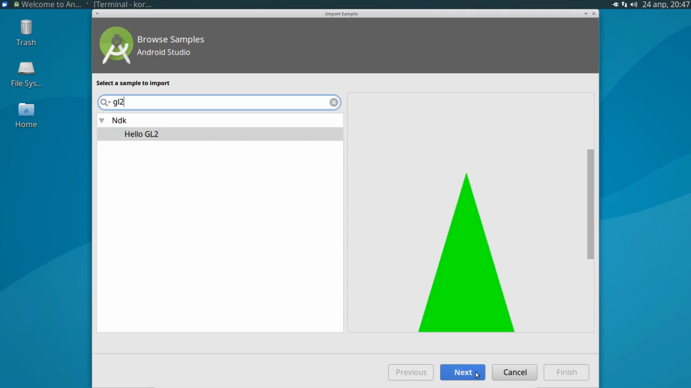

  Locate 'Hello GL2' sample and import it.

<a name="step-try-run-gl2"/>

1.8.13. Try to run 'Hello GL2' sample
-------------------------------------

  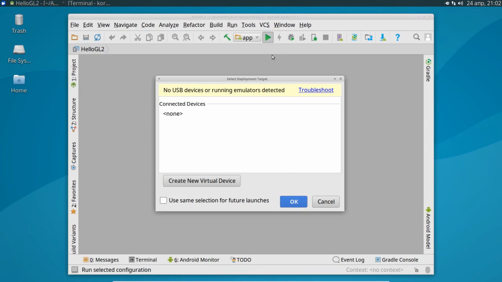

  When we try to run 'Hello GL2' sample, an empty list
  of devices is presented.

<a name="step-start-avd"/>

1.8.14. Start AVD creation
--------------------------

  

  We need to create Android Virtual Device to run 'Hello GL2' sample.

<a name="step-definition"/>

1.8.15. Select device definition
--------------------------------

  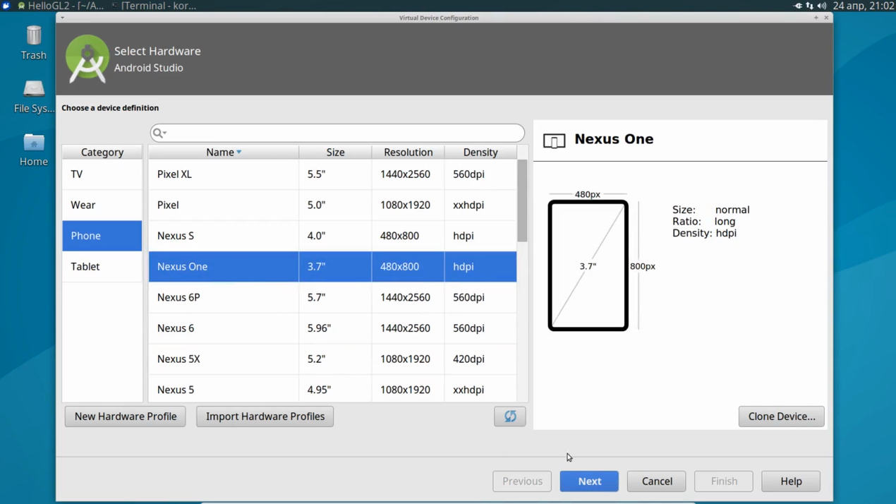

  Select device definition. This is effectively the size of AVD.

  This tutorial uses *Nexus One 3.7"* with 480x800 resolution.

<a name="step-dl-img"/>

1.8.16. Download system image
-----------------------------

  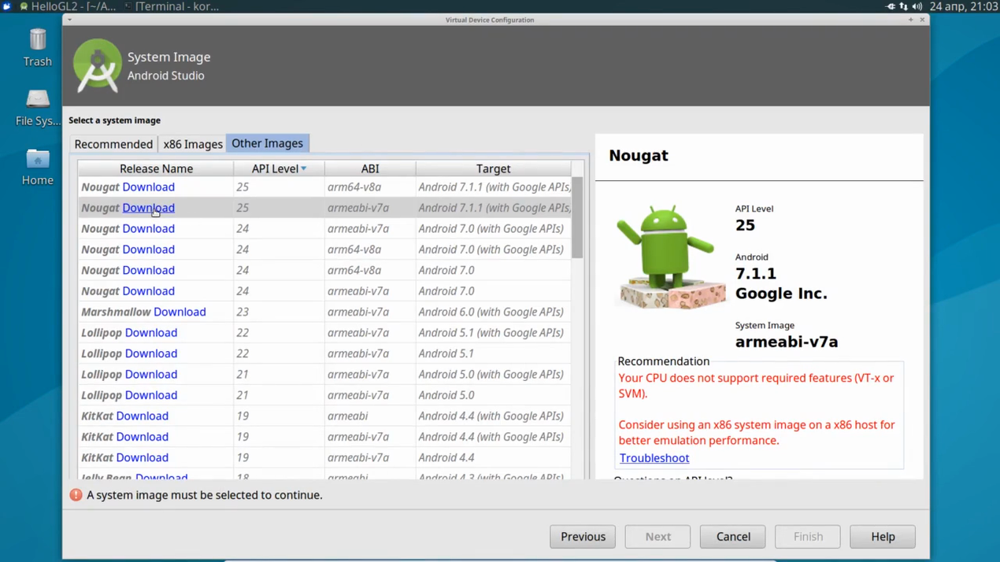

  Download *armeabi-v7a* system image. It emulates *ARMv7*, which is
  the most widespread architecture for Android.

  You may install other system images to test your application
  on other architectures.
  
<a name="step-select-img"/>

1.8.17. Select system image
---------------------------

  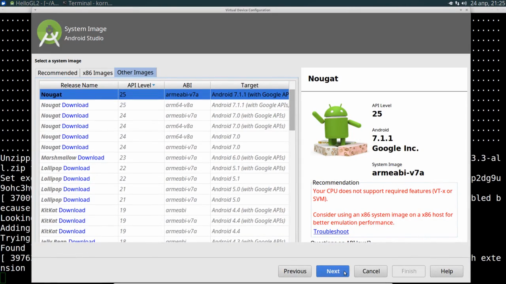

  Select downloaded system image.

<a name="step-software-gfx"/>

1.8.18. Select software graphics renderer
-----------------------------------------

  

  This step is optional. You only need to select software graphics renderer
  if you run Android Studio in an environment that lacks 3D acceleration.

<a name="step-run-gl2"/>

1.8.19. Run 'Hello GL2' sample
------------------------------

  

  Select created AVD to run the sample.

<a name="step-observe-gl2"/>

1.8.20. Observe 'Hello GL2' sample
----------------------------------

  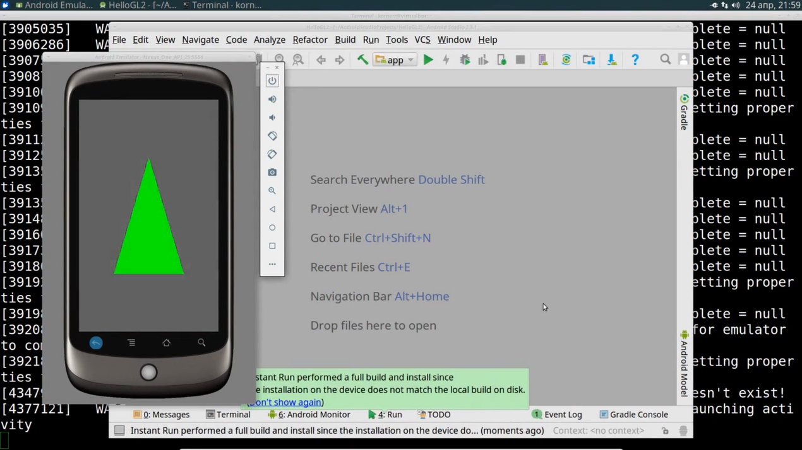

  You should see green triangle. This means AVD can display GLES2 graphics.

<a name="step-start-project"/>

1.8.21. Start a new Android Studio project
------------------------------------------

  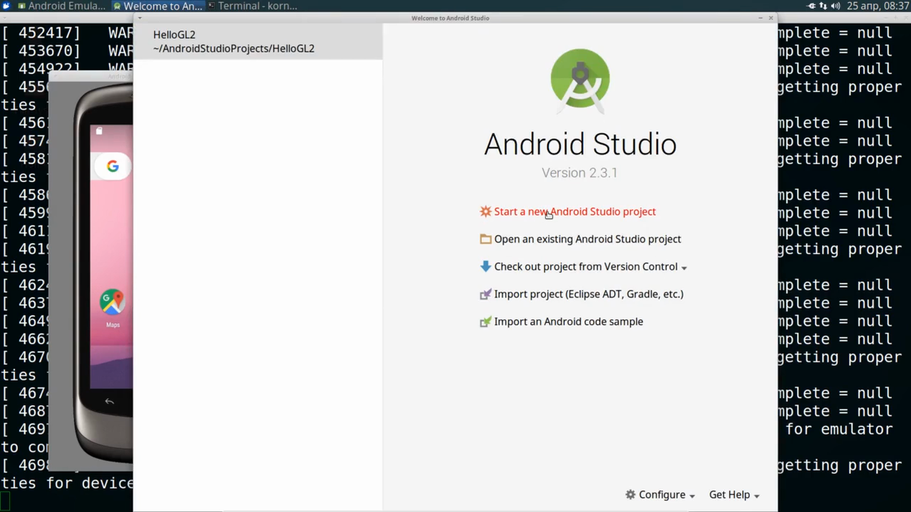

  Start a new Android Studio project.

<a name="step-cpp-support"/>

1.8.22. Include C++ support
---------------------------

  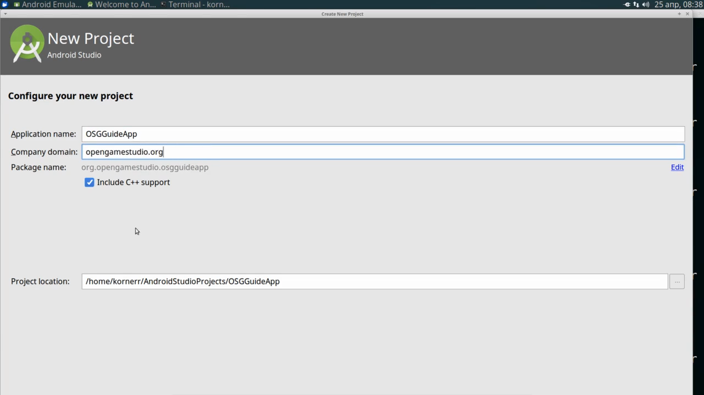

  This option adds sample C++ native library to the project.

  We will use its CMakeLists.txt file later.

<a name="step-empty-activity"/>

1.8.23. Select empty activity
-----------------------------

  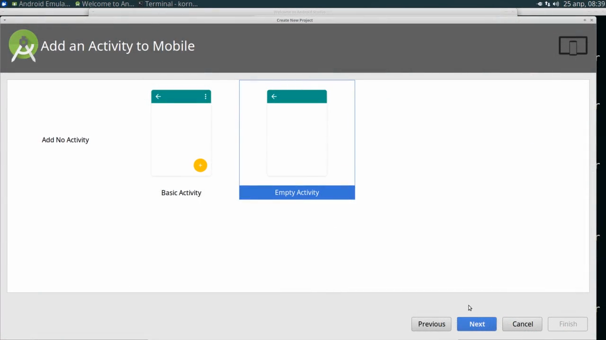

  Since we only need one screen, select empty activity.

<a name="step-cpp11"/>

1.8.24. Turn on C++11, exceptions, and RTTI
-------------------------------------------

  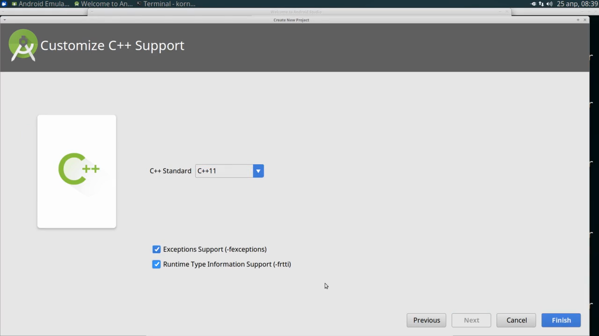

  Turn on C++11, exceptions, and RTTI, because they are necessary
  to build OpenSceneGraph.

<a name="step-run-stub"/>

1.8.25. Run the project
-----------------------

  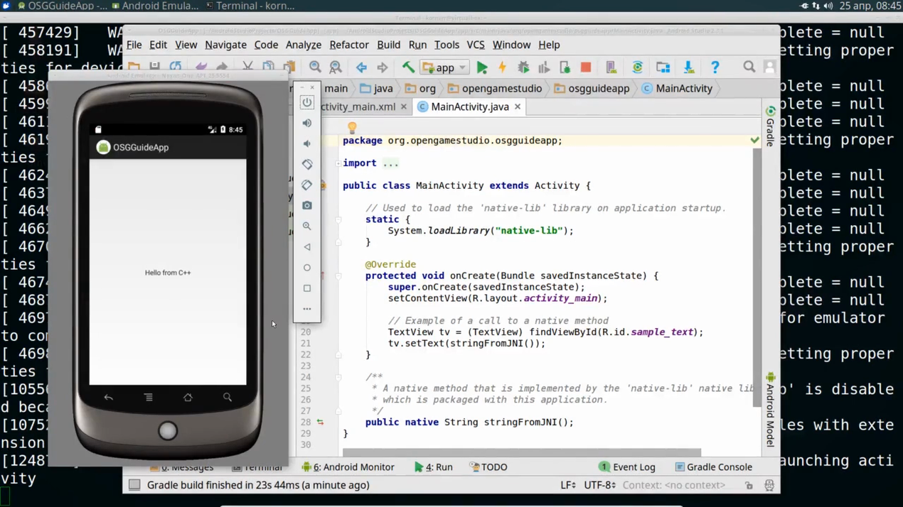

  Run the project. It should display a screen with *Hello from C++* text.

<a name="step-osg"/>

1.8.26. Clone OSG alongside the project
---------------------------------------

  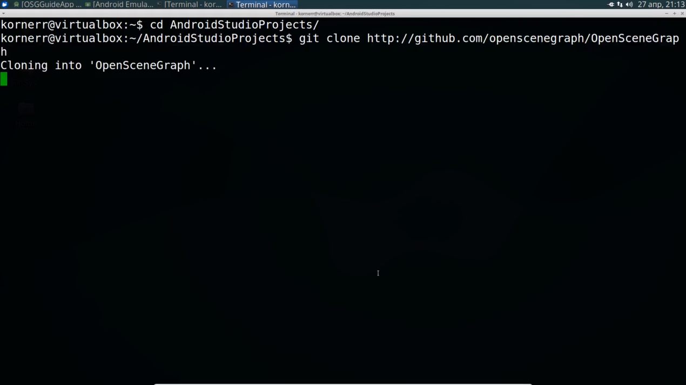

  Clone OpenSceneGraph alongside the project with the following commands:

  `cd ~`

  `cd AndroidStudioProjects`

  `git clone https://github.com/openscenegraph/OpenSceneGraph`

  **Note**: you must place OpenSceneGraph alongside the project, because
  sample OpenSceneGraph application's Android part requires it.

<a name="step-osg-app"/>

1.8.27. Clone sample OSG application alongside the project
----------------------------------------------------------

  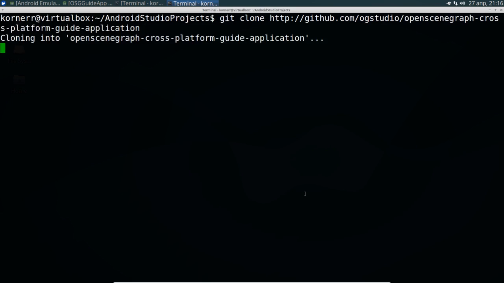

  Clone sample OpenSceneGraph application alongside the project
  with the following commands:

  `cd ~`

  `cd AndroidStudioProjects`

  `git clone https://github.com/ogstudio/openscenegraph-cross-platform-guide-application`

  **Note**: you must place sample OpenSceneGraph application alongside
  the project, because sample OpenSceneGraph application's Android part
  requires it.

<a name="step-copy"/>

1.8.28. Copy Android part into the project
------------------------------------------

  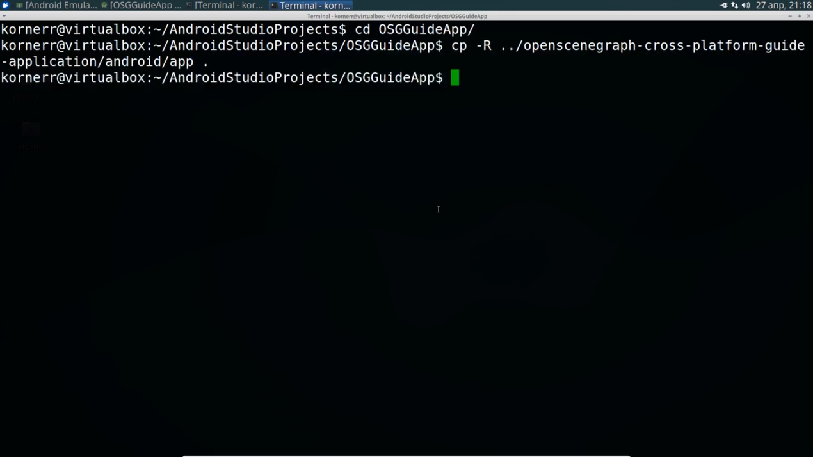

  Copy Android part into the project with the following commands:

  `cd ~`

  `cd AndroidStudioProjects`
 
  `cp -R openscenegraph-cross-platform-guide-application/android/app /path/to/the/project`

  Sample OpenSceneGraph application's *android/app* directory contains
  RenderActivity with backing native library, box model, and a few supporting files.

  *android/app* is almost all you need to run OpenSceneGraph
  application under Android.

<a name="step-manifest"/>

1.8.30. Update AndroidManifest
------------------------------

  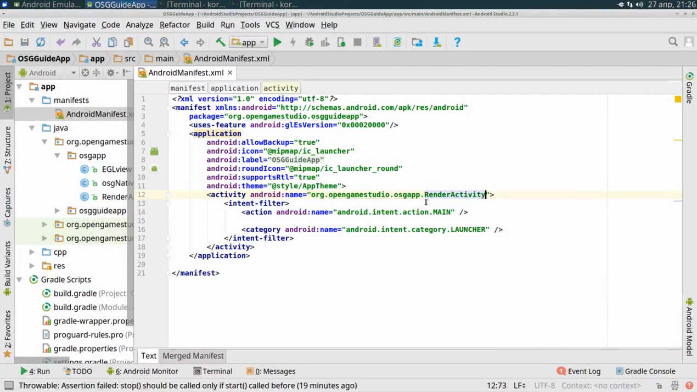

  * Request GLES2 support by adding

  `<uses-feature android:glEsVersion="0x00020000"/>`

  * Make RenderActivity the main activity by referencing it with

  `<activity android:name="org.opengamestudio.osgapp.RenderActivity">`

<a name="step-cmake"/>

1.8.31. Update CMakeLists
-------------------------

  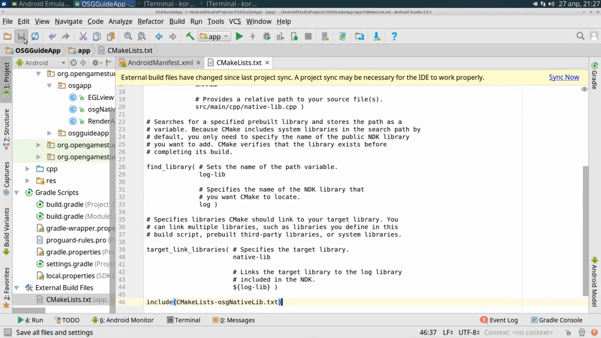

  Reference RenderActivity's backing native library's CMakeLists file
  by adding

  `include(CMakeLists-osgNativeLib.txt)`

  to the project's CMakeLists file.

<a name="step-abi"/>

1.8.32. Specify target ABIs
---------------------------

  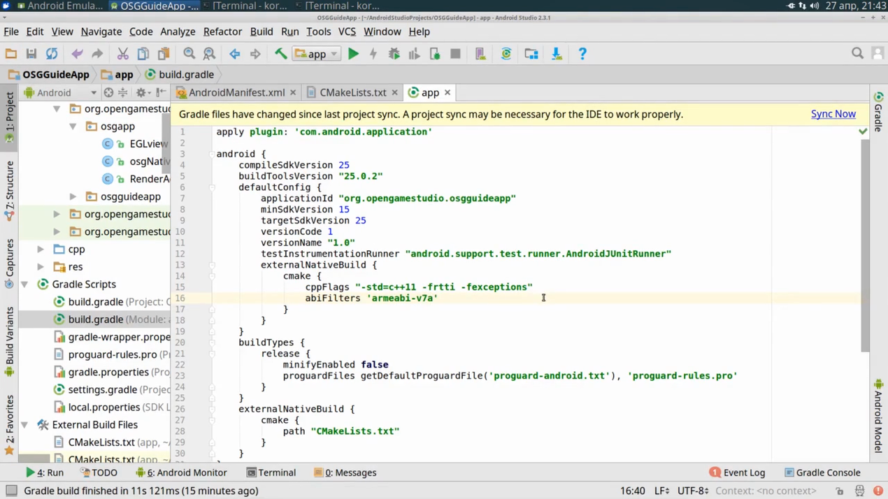

  This step is optional.

  By default, Android Studio builds the project for all supported architectures.
  Each architecture requires its own build of OpenSceneGraph. OpenSceneGraph build
  for single architecture takes about 1.5G.

  We restrict the project to ARMv7 ABI to save disk space.

<a name="step-build"/>

1.8.33. Build the project
-------------------------

  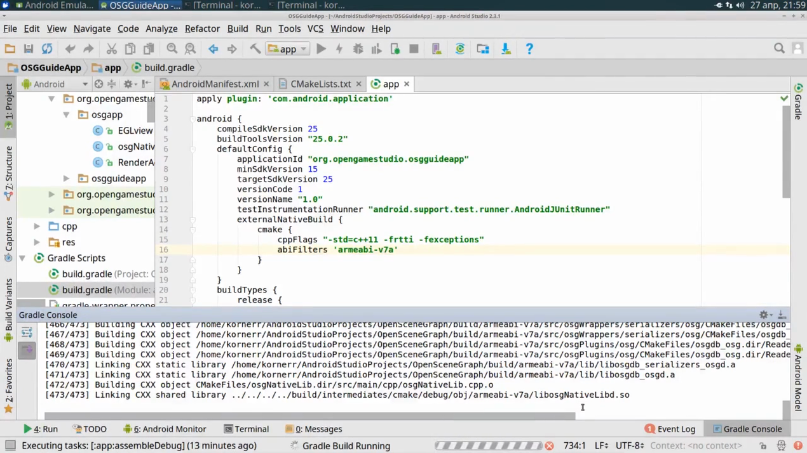

  This builds OpenSceneGraph as static libraries and links them
  to RenderActivity's backing native library called `osgNativeLib`.

  **Note**: make note of the native library's full name.

<a name="step-run"/>

1.8.34. Try to run the project
------------------------------

  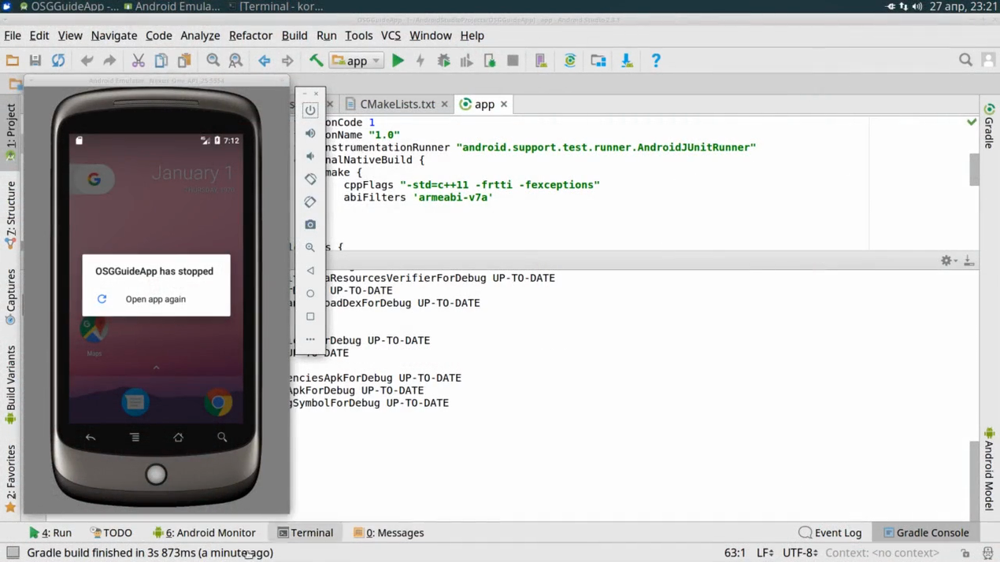

  Try to run the project.

<a name="step-error"/>

1.8.35. Observe error
---------------------

  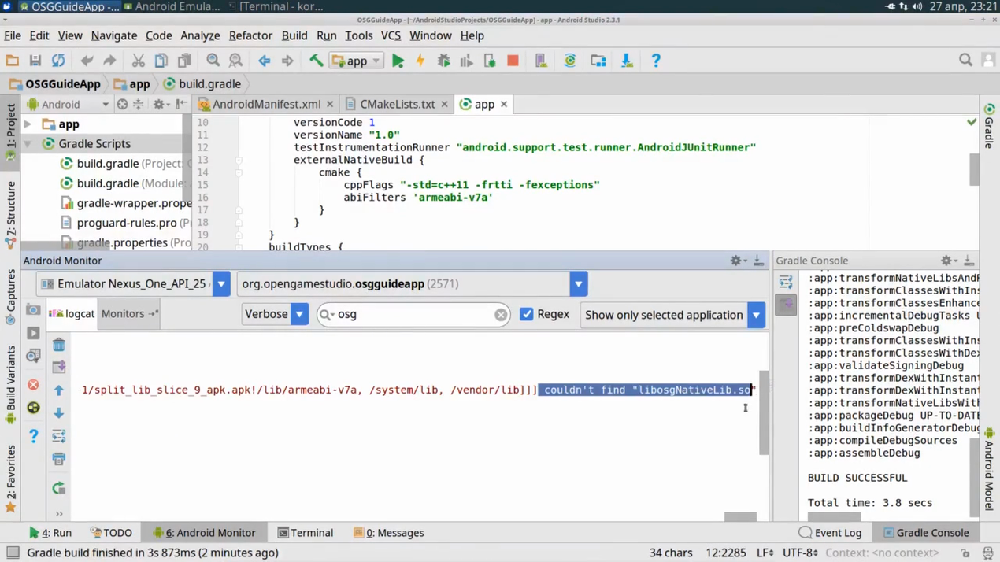

  The logs say that `osgNativeLib` is missing.

  As you noted above, the name should read like `osgNativeLibd`.
  `d` postfix is a side effect of building OpenSceneGraph in Debug mode.

<a name="step-fix"/>

1.8.36. Fix osgNativeLib reference
----------------------------------

  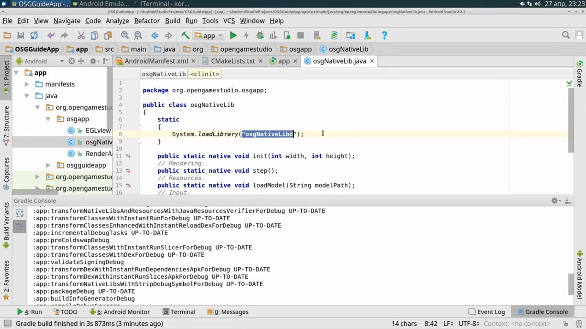

  Open `osgNativeLib.java` and reference `osgNativeLibd`
  instead of `osgNativeLib`.

<a name="step-result"/>

1.8.37. Run the project
-----------------------

  

  You should now see red cube displayed.

