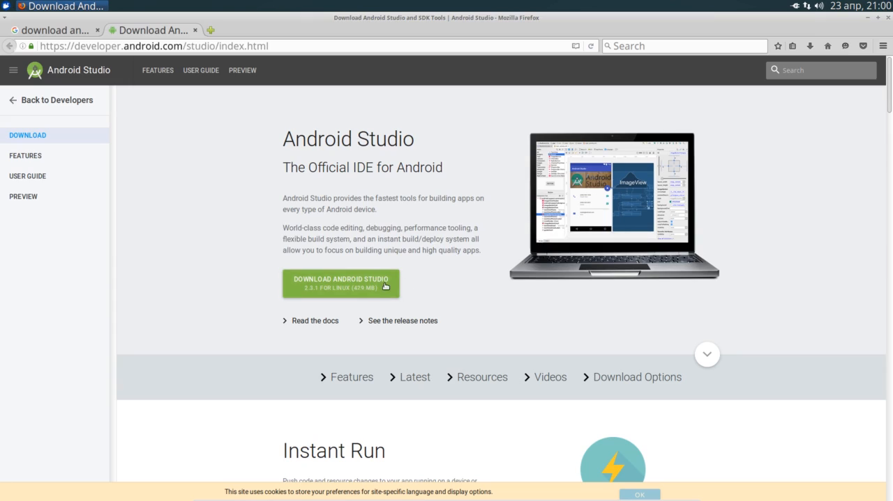
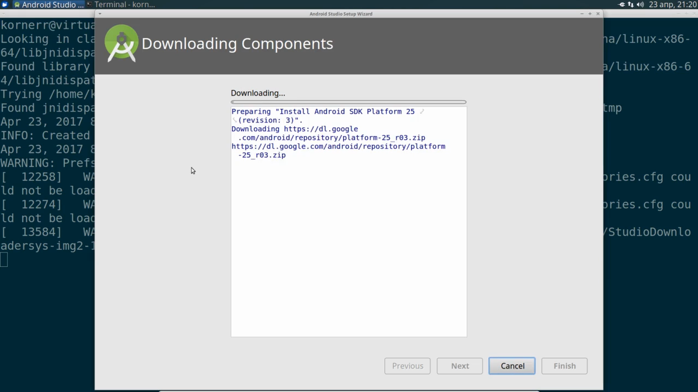
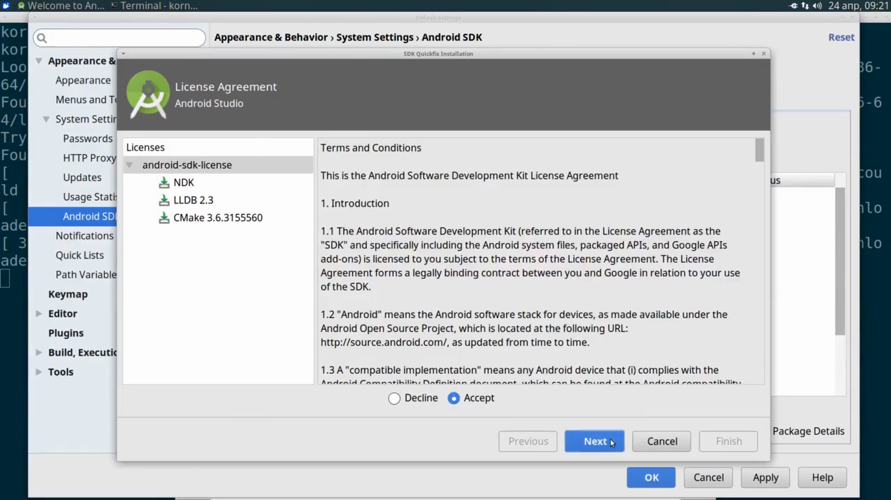
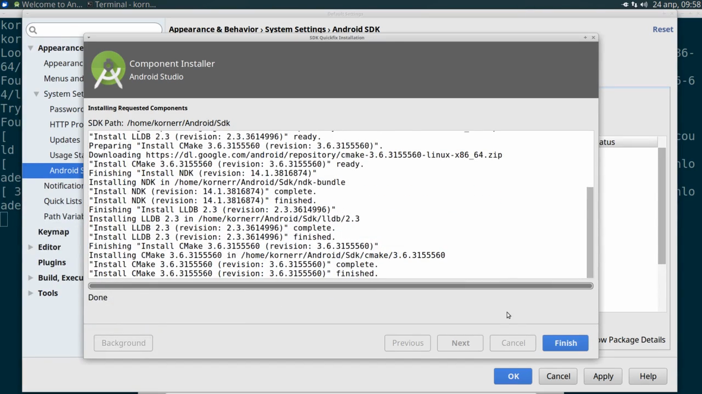
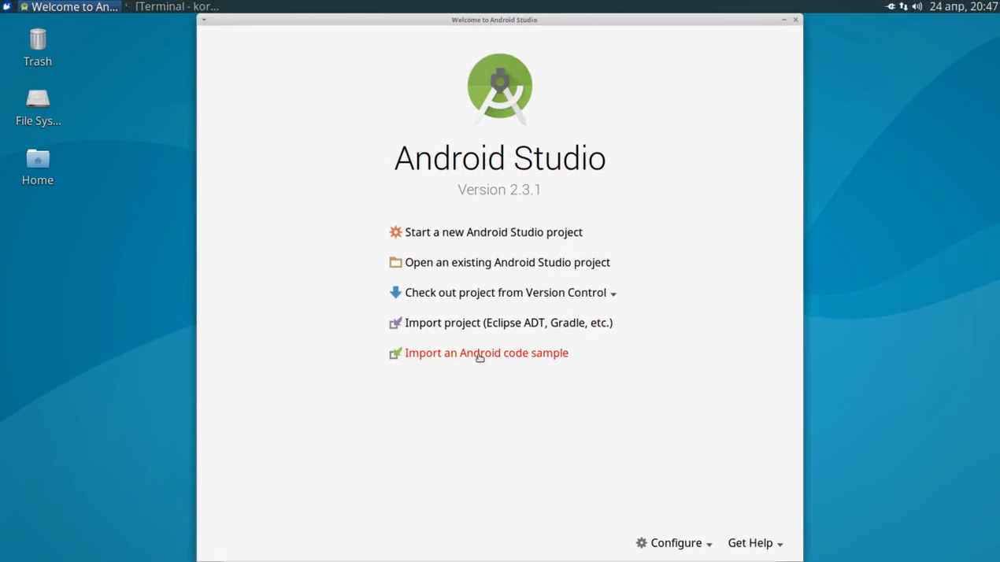
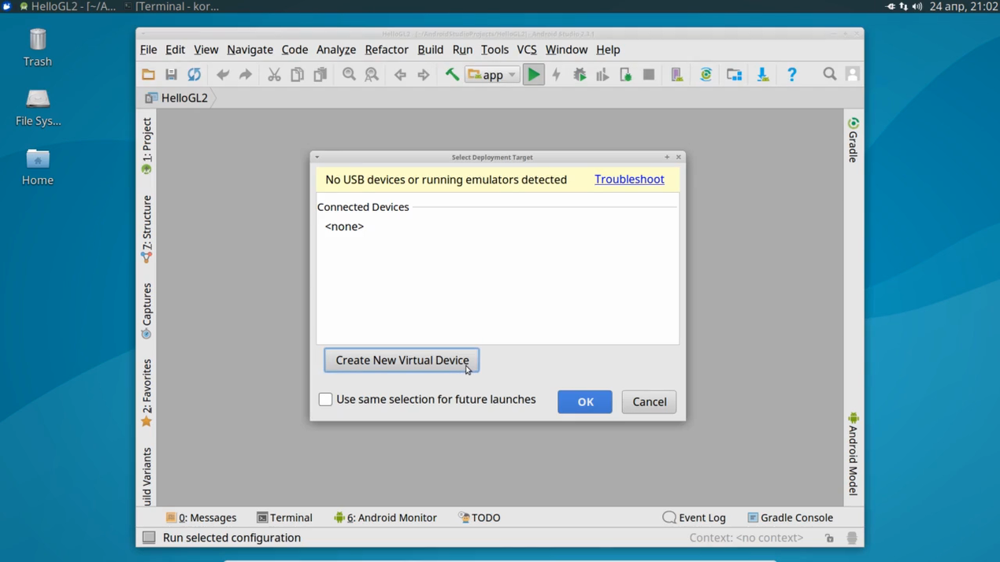
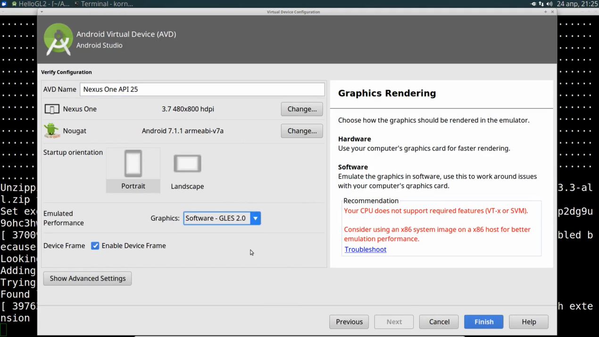
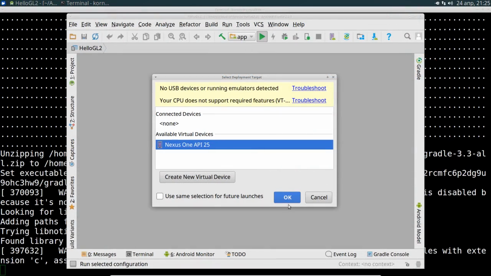

Table of contents
=================

* [Overview](#overview)
* [Video](#video)
* [Steps](#steps)
  * [1.8.1. Download Android Studio](#step-dl-as)
  * [1.8.2. Install 32-bit libraries](#step-32-libs)
  * [1.8.3. Unpack Android Studio](#step-unpack-as)
  * [1.8.4. Run Android Studio](#step-run-as)
  * [1.8.5. Select standard installation options](#step-install-as)
  * [1.8.6. Wait for components to install](#step-wait-as)
  * [1.8.7. Run SDK Manager](#step-run-sdk)
  * [1.8.8. Select CMake, LLDB, NDK components](#step-select-ndk)
  * [1.8.9. Accept license](#step-license)
  * [1.8.10. Wait for CMake, LLDB, NDK to install](#step-wait-ndk)
  * [1.8.11. Start Android code sample import](#step-import)
  * [1.8.12. Import 'Hello GL2' sample](#step-import-gl2)
  * [1.8.13. Try to run 'Hello GL2' sample](#step-try-run-gl2)
  * [1.8.14. Start AVD creation](#step-start-avd)
  * [1.8.15. Select device definition](#step-definition)
  * [1.8.16. Download system image](#step-dl-img)
  * [1.8.17. Select system image](#step-select-img)
  * [1.8.18. Select software graphics renderer](#step-software-gfx)
  * [1.8.19. Run 'Hello GL2' sample](#step-run-gl2)
  * [1.8.20. Observe 'Hello GL2' sample](#step-observe-gl2)

<a name="overview"/>

Overview
========

This tutorial is part of [OpenSceneGraph cross-platform guide](http://github.com/OGStudio/openscenegraph-cross-platform-guide).

In this tutorial we build and run
[sample OpenSceneGraph application](http://github.com/OGStudio/openscenegraph-cross-platform-guide-application)
under Android. The application displays provided model with simple GLSL shaders.

**Note**: this tutorial requires
* OpenSceneGraph model (see [1.1. Create a cube](../1.1.CreateCube))

<a name="video"/>

Video
=====

[YouTube](todo) | [Download](readme/video.mp4)

Video depicts running and building sample OpenSceneGraph application
with Android Studio 2.3.1 under Xubuntu 16.04.

<a name="steps"/>

Steps
=====

**Note**: steps below use frames from the video as screenshots.
Watch the video to see all details.

<a name="step-dl-as"/>

1.8.1. Download Android Studio
------------------------------

  

  Download the latest version of Android Studio.
  It contains all the tools you need to develop for Android.

<a name="step-32-libs"/>

1.8.2. Install 32-bit libraries
-------------------------------

  

  According to [Android Studio installation instructions](https://developer.android.com/studio/install.html)
  64-bit Ubuntu needs several 32-bit libraries to make Android Studio work.

  Install necessary 32-bit libraries with the following command:

  `sudo apt-get install libc6:i386 libncurses5:i386 libstdc++6:i386 lib32z1 libbz2-1.0:i386`

<a name="step-unpack-as"/>

1.8.3. Unpack Android Studio
----------------------------

  

  Extract Android Studio archive into your home directory.

<a name="step-cfg-as"/>

1.8.4. Run Android Studio
-------------------------------

  

  Run Android Studio with the following commands:

  `cd ~`

  `./android-studio/bin/studio.sh`

<a name="step-install-as"/>

1.8.5. Select standard installation options
-------------------------------------------

  

  Select standard installation options.

<a name="step-wait-as"/>

1.8.6. Wait for components to install
-------------------------------------

  

  Wait for standard components to install.

<a name="step-run-sdk"/>

1.8.7. Run SDK Manager
----------------------

  

  We will use SDK manager to install additional components.

<a name="step-install-ndk"/>

1.8.8. Select CMake, LLDB, NDK components
-----------------------------------------

  

  We need CMake, LLDB, and NDK components to build C++ for Android.

  Select them in *SDK Tools* tab of *SDK Manager*.

<a name="step-license"/>

1.8.9. Accept license
---------------------

  

  To install CMake, LLDB, and NDK, we need to accept the license.

<a name="step-wait-ndk"/>

1.8.10. Wait for CMake, LLDB, NDK to install
--------------------------------------------

  

  Wait for additional components to install.

<a name="step-import"/>

1.8.11. Start Android code sample import
----------------------------------------

  

  Select *Import an Android code sample*.

<a name="step-import-gl2"/>

1.8.12. Import 'Hello GL2' sample
---------------------------------

  

  Locate 'Hello GL2' sample and import it.

<a name="step-try-run-gl2"/>

1.8.13. Try to run 'Hello GL2' sample
-------------------------------------

  

  When we try to run 'Hello GL2' sample, an empty list
  of devices is presented.

<a name="step-start-avd"/>

1.8.14. Start AVD creation
--------------------------

  

  We need to create Android Virtual Device to run 'Hello GL2' sample.

<a name="step-definition"/>

1.8.15. Select device definition
--------------------------------

  

  Select device definition. This is effectively the size of AVD.

  This tutorial uses *Nexus One 3.7"* with 480x800 resolution.

<a name="step-dl-img"/>

1.8.16. Download system image
-----------------------------

  

  Download *armeabi-v7a* system image. It emulates *ARMv7*, which is
  the most widespread architecture for Android.

  You may install other system images to test your application
  on other architectures.
  
<a name="step-select-img"/>

1.8.17. Select system image
---------------------------

  

  Select downloaded system image.

<a name="step-software-gfx"/>

1.8.18. Select software graphics renderer
-----------------------------------------

  

  This step is optional. You only need to select software graphics renderer
  if you run Android Studio in an environment that lacks 3D acceleration.

<a name="step-run-gl2"/>

1.8.19. Run 'Hello GL2' sample
------------------------------

  

  Select created AVD to run the sample.

<a name="step-observe-gl2"/>

1.8.20. Observe 'Hello GL2' sample
----------------------------------

  

  You should see green triangle. This means AVD can display GLES2 graphics.

