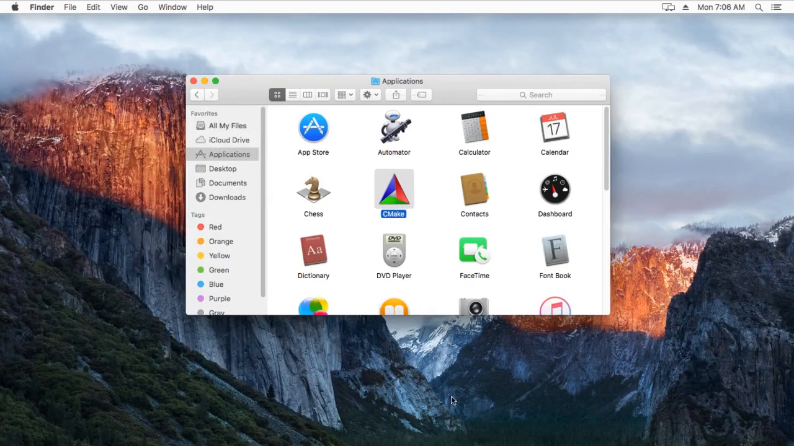
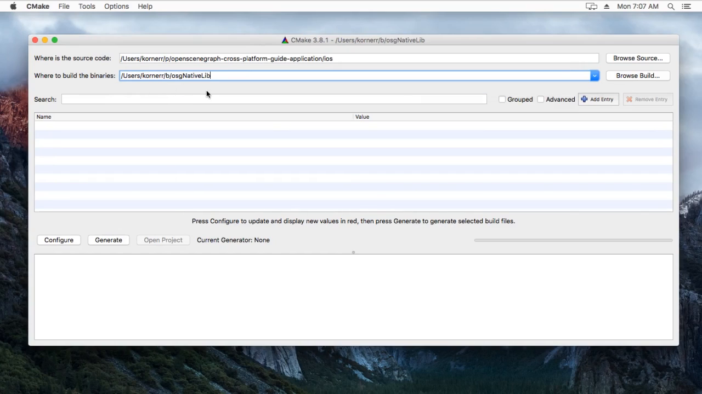
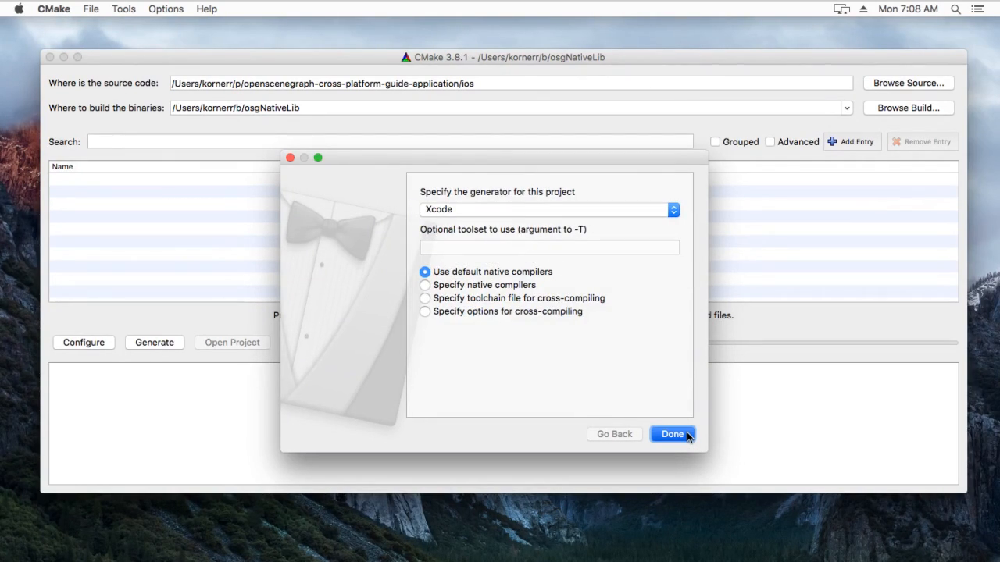
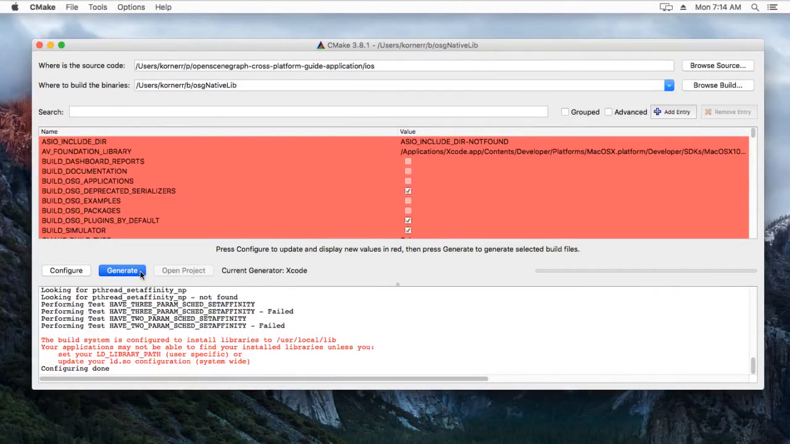

Table of contents
=================

* [Overview](#overview)
* [Video](#video)
* [Steps](#steps)
  * [1.9.1. Create build directory](#step-build-dir)
  * [1.9.2. Launch CMake](#step-open-cmake)
  * [1.9.3. Specify build and source directories](#step-dirs)
  * [1.9.4. Configure osgNativeLib and OSG](#step-cfg)
  * [1.9.5. Generate Xcode project file](#step-generate)
  * [1.9.6. Build osgNativeLib and OSG](#step-build)

* Launch Xcode
* Start a new Xcode project
* Select single view application
* Select Objective-C language
* Finish project creation
* Copy osgNativeLib
* Copy view controller and model
* Add copied files to the project
* Select render view controller as the main interface
* Reference osgNativeLib headers
* Launch application

<a name="overview"/>

Overview
========

This tutorial is part of [OpenSceneGraph cross-platform guide](http://github.com/OGStudio/openscenegraph-cross-platform-guide).

In this tutorial we build and run
[sample OpenSceneGraph application](http://github.com/OGStudio/openscenegraph-cross-platform-guide-application)
under iOS. The application displays provided model with simple GLSL shaders.

**Note**: this tutorial requires
* OpenSceneGraph model (see [1.1. Create a cube](../1.1.CreateCube))
* Xcode and CMake installations (see [1.4. Install OpenSceneGraph under macOS](../1.4.InstallUnderMacOS))
* OpenSceneGraph sources (see [1.4. Install OpenSceneGraph under macOS](../1.4.InstallUnderMacOS))
* sample OpenSceneGraph application sources (see [1.7. Build and run sample OpenSceneGraph application under macOS](../1.7.SampleUnderMacOS))

<a name="video"/>

Video
=====

[YouTube](todo) | [Download](readme/video.mp4)

Video depicts running and building sample OpenSceneGraph application
for iOS simulator with iOS 10.

<a name="steps"/>

Steps
=====

**Note**: steps below use frames from the video as screenshots.
Watch the video to see all details.

<a name="step-build-dir"/>

1.9.1. Create build directory
-----------------------------

  

  Create build directory for iOS simulator build of osgNativeLib,
  a native C++ library to be used in Objective-C.

  osgNativeLib also builds OpenSceneGraph inside
  `/path/to/OpenSceneGraph/build/Simulator`.

  *Note*: iOS simulator build only works under iOS simulator. If you need
  to build for a real device, you need to build osgNativeLib
  with `BUILD_SIMULATOR=NO` in a separate directory. In such a case
  OpenSceneGraph is built inside `/path/to/OpenSceneGraph/build/Device`.

<a name="step-open-cmake"/>

1.9.2. Launch CMake
-------------------

  

  Open CMake

<a name="step-dirs"/>

1.9.3. Specify build and source directories
-------------------------------------------

  

  Specify build and source directories.

<a name="step-cfg"/>

1.9.4. Configure osgNativeLib and OSG
-------------------------------------

  

  Press `Configure`. Select `Xcode` generator when prompted.

<a name="step-generate"/>

1.9.5. Generate Xcode project file
-----------------------------------

  

  Press `Generate` to generate Xcode specific project file.

<a name="step-build"/>

1.9.6. Build osgNativeLib and OSG
---------------------------------

  

  Build osgNativeLib and OpenSceneGraph with the following command:

  `xcodebuild -IDEBuildOperationMaxNumberOfConcurrentCompileTasks=8 -configuration Release`

  At the end this also combines osgNativeLib and several OpenSceneGraph
  libraries into single library called `libosglib.a`. This is done by
  osgNativeLib build process for convenience.

